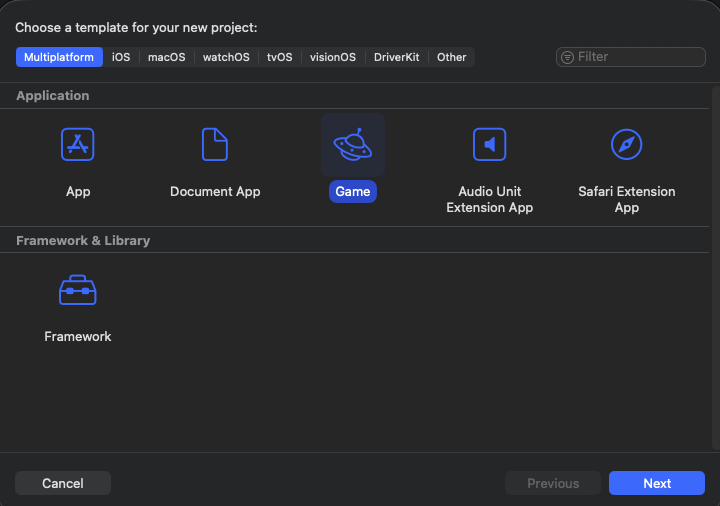
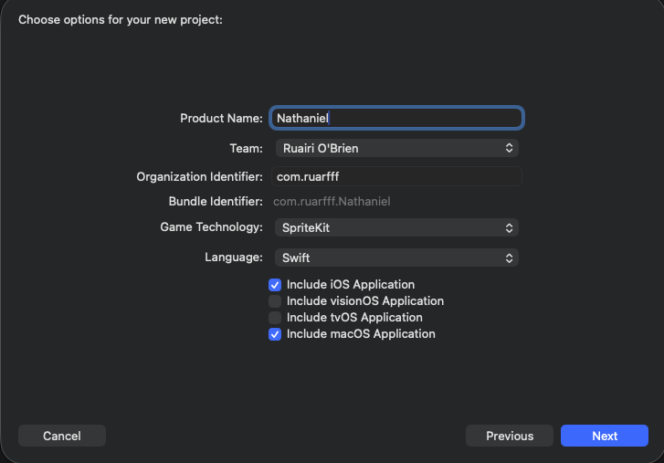
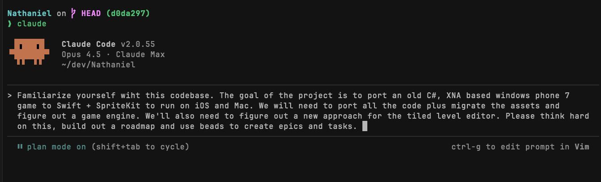
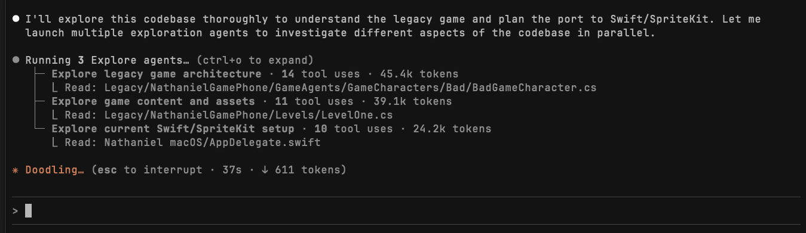
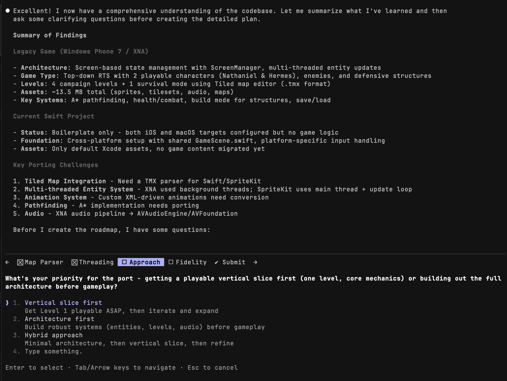
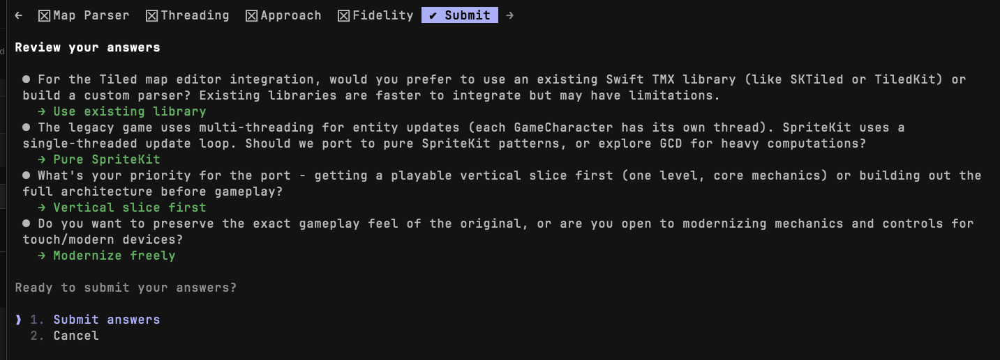
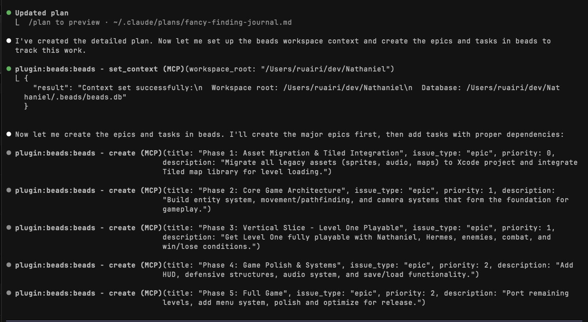
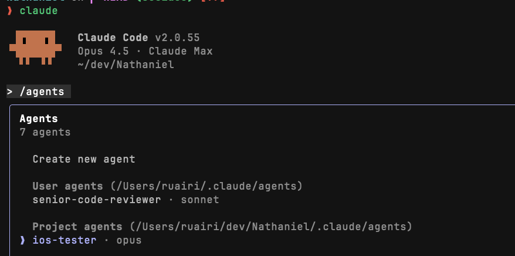
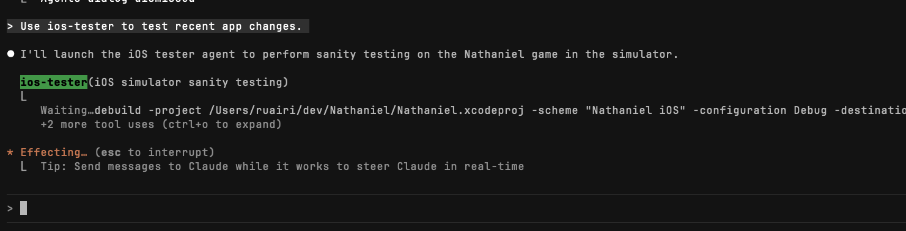
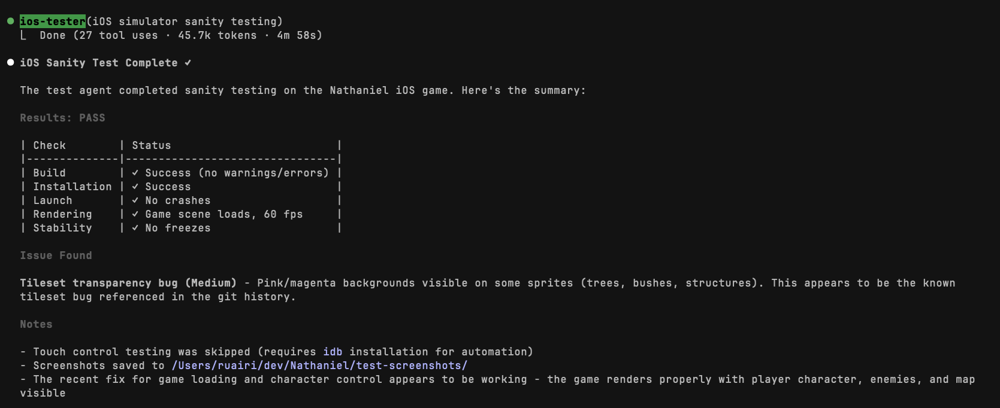

I am trying to understand how to leverage coding agents but I am a simple person and want to keep it simple. I don't care about the hype around AI coding and I find most of the discourse around it annoying.

I've always been into new shiny tools though. I'm forever messing around with editors, IDEs, CLIs etc. I've wasted massive amounts of time playing around with tools that don't exist anymore.

In college we learned to code in assembly. C seemed very simple by comparison. Then object oriented languages and scripting seemed quaint. IDEs with refactoring and autocomplete made coding much easier. Tools like React and the ability to install npm packages made hacking a UI together somewhat less miserable and then before long somehow much more miserable. I had to take time to learn each new thing before it became useful but I enjoyed the learning. Now it's LLMs and agents. They're different but it's a similar feeling.

It started with GitHub copilot and fancy autocomplete. Then web chat interfaces, copying and pasting code back and forth like [StackOverflow](https://stackoverflow.com/). Now we've got coding agents.

Agents are a useful tool because you can give them work that you would otherwise have to do yourself and they'll just go and try to do it, with varying degrees of success. Using techniques I discuss here, I try to increase the frequency of success.

Using the term "agents" in this context, I'm thinking about instances of a coding agent, i.e. one context window. A single LLM thread, primed with some context and with access to a set of tools.

Agents are limited by their context window so you can only do so much before they start to go a bit crazy. Most LLMs are currently [Autoregressive](https://en.wikipedia.org/wiki/Autoregressive_model) so performance varies depending on what's in the context at the time. At least for now, it makes sense to optimize running many small agent sessions over one long one and therefore crafting a workflow that is good for that.

Here's my list of characteristics for a good coding agent setup:

- A good context primer (AGENTS.md) so each new agent starts well.
- Context primers for different types of work, most coding agents now support custom sub-agents for this.
- A way for agents to track and remember work.
- The ability to run multiple agents in parallel.
- A good set of tools for the agents to use.
- Sensible defaults for things like permitted commands.

For my own stuff, I use Claude Code. For work I use GitHub Copilot. In this post I'll focus on Claude Code and will likely follow up with a Copilot version.

## Example Project Setup

My choice of project here might not be ideal and unless you do iOS development, you may not be able to repeat the steps on your own machine (which is fine) but it does illustrate something about coding agents. I'm not an iOS developer. This is a project I've wanted to do for years but would probably never have bothered with, until now and until coding agents made it easier.

I made a windows phone game when I was in college, showing incredible foresight into where that technology was heading.

I want to port the game over to iOS and I want to learn about native iOS development using Swift in the process.

How I setup the project is not important, you could use any codebase here instead but here's what I did anyway:

- Create a new game in XCode.
- Set SpriteKit as the Game Technology.
- Set Swift as the language.
- Selected include iOS Application and include macOS Application (including macOS because why not)





All the code for the sample project is up here <https://github.com/ruarfff/Nathaniel>

After creating the project I setup a [.gitignore file for XCode projects](https://github.com/ruarfff/Nathaniel/blob/main/.gitignore).

I'm using the [jj VCS](https://github.com/jj-vcs/jj) here, which I recommend looking into for this kind of setup, but you can use a standard git commit/git push flow instead if you prefer.

Setup jj in the repo:

`jj git init --colocate`

Create a github repo for the project using the [GitHub CLI](https://cli.github.com/):

```shell
gh repo create Nathaniel --public --source=. --remote=origin
```

Something you'll see me do over an over is something I do right now after setting the repo up:

```shell
# Describe the working change, like git commit:
jj describe -m "Add gitignore"

# Put all changes on main:
jj bookmark set main -r @

#Push changes to the github repo:
jj git push

# Or if creating a new branch which I needed to do first time here:
jj git push --allow-new
```

I just do this 3 step process all the time. There might be some easier way but this is the habit I've formed.

At this point, there are 2 commits. The initial commit from XCode and the gitignore commit.

Now those commits are up on github [here](https://github.com/ruarfff/Nathaniel/commit/a0c16ea5d85009b3897c23cdd8933416a5e42735)  and [here](https://github.com/ruarfff/Nathaniel/commit/a0c16ea5d85009b3897c23cdd8933416a5e42735).

Then I took my old Windows Phone app code and put it into a directory called `Legacy`.

I did hit an warning trying to commit that using jj. Some game assets are large so I needed to configure max size:

`jj config set --repo snapshot.max-new-file-size 2049292`

Then:

```shell
jj describe -m "Add old windows phone 7 game code."
jj bookmark set main -r @
jj git push
```

Code ended up here <https://github.com/ruarfff/Nathaniel/tree/main/Legacy>

Hopefully that gives you an idea of the code we're working with. Now it's time to prepare the agent coding configurations.

## Coding Agent Setup with Task Management and Memory

There is a tool called beads <https://github.com/steveyegge/beads> that is an interesting concept for managing agent work. Agents can use it to create and track issues. It has a graph structure to help an agent navigate historical tasks without loading everything into context unnecessarily.

There are other similar tools like [github's spec-kit](https://github.com/github/spec-kit) that track things in yaml files and provide tools to help agents manage work with scripts, custom commands etc. There will likely be many more options over time but right now, beads is the one I find most intuitive and with the lowest cognitive load.

The [beads repo](https://github.com/steveyegge/beads) has a good setup guide but here's what I did:

```shell
# Install beads
brew tap steveyegge/beads
brew install bd

# Set it up in the project
bd init
```

This gets beads ready by creating some files in the repo, some you commit, some you don't. Beads provides a `.gitignore`.

```shell
jj describe -m "Add initial beads setup."
jj bookmark set main -r @
jj git push
```

### AGENTS.md

I am using [claude code](https://www.claude.com/product/claude-code) so, in the project directory I run `claude`. I run `/model` in the prompt input to make sure I'm on the latest and greatest, Opus 4.5 at time of writing. Then I run `/init` to allow claude to set things up for itself.

Claude will generate a `CLAUDE.md` file.

By default, claude code uses a CLAUDE.md file. I prefer using [AGENTS.md](https://agents.md) since it appears to be an emerging standard and just makes things a little easier if I want to use other coding agents in the same project.

```shell
# Create an AGENTS.md file

touch AGENTS.md
```

One option to make it use AGENTS.md is to symlink, e.g. `ln -s AGENTS.md CLAUDE.md`

What I decided to do is copy the contents of CLAUDE.md into AGENTS.md and update CLAUDE.md to:

```markdown
# CLAUDE.md

This file provides guidance to Claude Code (claude.ai/code) when working with code in this repository.


Read instructions from AGENTS.md:

@AGENTS.md
```

@AGENTS.md should essentially template in the contents so claude will use what's in there.

Next I asked claude to run `bd onboard` (I ran `claude` and said "please run `bd onboard`")

This updated the AGENTS.md file. It also create a copilot instructions file which I decided to delete.

```shell
jj describe -m "Add AGENTS.md and run bd oboard."
jj bookmark set main -r @
jj git push
```

That results in [this commit](https://github.com/ruarfff/Nathaniel/commit/d0da297f450fd0dff188df2ee5ae1476b03d9e88).


## Coming up with a Plan

Usually working on a project I'd have a good idea of what I want to do and how to do it. This time I really don't have a clue. Claude, and most other coding agents, have the concept of sub agents. One that Claude comes with is a plan agent.

I run Claude, hit Shift + Tab twice, and give it this prompt (Claude is very forgiving of my typos and bad spelling):

> Familiarize yourself wiht this codebase. The goal of the project is to port an old C#, XNA based windows phone 7
  game to Swift + SpriteKit to run on iOS and Mac. We will need to port all the code plus migrate the assets and
  figure out a game engine. We'll also need to figure out a new approach for the tiled level editor. Please think hard
  on this, build out a roadmap and use beads to create epics and tasks.




The planning agent spins up multiple agents to get through the task faster:



I then get prompted to give some feedback and make some decisions:



I get a summary of the decisions:



Then the agent gets to work creating a roadmap in beads:



Because I really don't know what to do here, i.e. I've never used Swift, SpriteKit and don't know how to go about porting the game, I'm letting the Claude plan agent figure out most of the details for me. Usually I'd provide a lot more direction and be more interactive, creating tasks step by step. Sometimes I'd create a beads task directly but usually I'd tell the agent what I want to happen and have it create the tasks for me.

Something I haven't shown here so far is Claude asking me for permissions to do stuff. I do have some things I always allow and others I prefer to be prompted for, just to feel like I have some control. See <https://code.claude.com/docs/en/settings> for how to manage these settings.

At this point, Claude created a plan but I wasn't paying attention and it went off and started working on it too.

It ran through some of the changes and they did not work. I decided to commit anyway since the plan is in there:

```shell
jj describe -m "Add plan and initial content pipeline"
jj bookmark set main -r @
jj git push
```

Resulting in [this commit](https://github.com/ruarfff/Nathaniel/commit/2188b9451a8a7dd9215b90dbbcd27aa6aec25101)

The app was failing to load saying it couldn't load maps. I toggled planning mode (Shift + Tab twice) and asked Claude to come up with a plan to fix it.

Claude went and got some tasks ready in beads. At this point I want to start a new context window. Always worth clearing the context when there's a pause.

I type `/clear` and hit Shift + Tab to toggle 'accept edits' on.

So with a fresh context I prompt:

> Please review tasks in beads and pick up the highest priority issue.

This is essentially my workflow. Plan, prioritize, execute. Get the agent to do as much of the work as possible.

## Custom Agents

The plan agent (Shift + Tab twice) is pretty cool. It's an example of a custom agent.

Custom agents have some nice features, like their own context window and the ability to prime them with instructions that you can run repeatedly. You can also curate the tools they have access to.

A fair comment might be that custom agents are almost alway overkill and that's probably true but I found two use cases I liked for this project.

There's the review agent, [literally the example in the docs](https://code.claude.com/docs/en/sub-agents#example-subagents), so I won't go into detail on that.

The other agent I find really useful is the game tester agent. An agent that runs the game and makes sure it's more or less working. I will explain how I set that up.

When you run Claude, you can execute an `/agents` command to see the list of agents you have.



You can see the agents I created here and also the 'Create new agent' option. If you select that, you will be guided through the process of setting an agent up.

To create the iOS tester agent, I ran that, saying I wanted to create an agent for testing an iOS game project. I knew I'd need some tools for it to use so I install the iOS Simulator MCP tool:

```shell
claude mcp add ios-simulator -- npx -y ios-simulator-mcp --env IOS_SIMULATOR_MCP_DEFAULT_OUTPUT_DIR=~/dev/Nathaniel/test-artifacts
```

I also created a document with a test plan to help guide the agent <https://github.com/ruarfff/Nathaniel/blob/main/docs/ios-test-plan.md>. I could probably make this even more advanced using [skills](https://www.claude.com/blog/skills) but this is good enough for now.

Here's the agent definition I ended up with <https://github.com/ruarfff/Nathaniel/blob/main/.claude/agents/ios-tester.md>.

I can run the agent just by telling Claude to use the agent by name:





## Running Agents In Parallel

You don't want to be waiting around for agents to finish. You probably want to be able to kick off multiple tasks and check in on them later.

Git has the concept of workspaces. So does jj. I'll use jj here of course but git workspaces work in a similar fashion.

Here's a simple example. I see two tasks that should be safe enough to do in parallel.

  - Create Weapon protocol and Gun (Nathaniel-0gc)
  - Port A* pathfinding (Nathaniel-6wt)

I'll create two workspaces:

```shell
jj workspace add ../nathaniel-agent1
jj workspace add ../nathaniel-agent2
```

This creates two directories at the same level as the working directory with copies of the code.

Prepare agent 1:

```shell
cd ../nathaniel-agent1
jj new main -m "Agent 1: Create Weapon protocol and Gun (Nathaniel-0gc)"
```

Prepare Agent 2:

```shell
cd ../nathaniel-agent2
jj new main -m "Agent 2: Port A* pathfinding (Nathaniel-6wt)"
```

```shell
cd ../Nathaniel # back to main
```

Setup the current change and see how the workspaces look:

```shell
 jj describe -m "Implement game mechanics"

❯ jj log
@  onvtmuyl ruairi 2025-11-29 15:52:10 default@ 9280b0d0
│  Implement game mechanics
│ ○  puxmrlmu ruairi 2025-11-29 15:50:31 nathaniel-agent2@ e946ae92
├─╯  (empty) Agent 2: Port A* pathfinding (Nathaniel-6wt)
│ ○  ooxnksvr ruairi 2025-11-29 15:50:08 nathaniel-agent1@ e1912bb8
├─╯  (empty) Agent 1: Create Weapon protocol and Gun (Nathaniel-0gc)
◆  nonoyurv ruairi 2025-11-29 15:39:35 main git_head() 30c1d06c
│  Fix game loading - game actually renders and character control works.

```

Create a tmux session for agent 1:

```shell
tmux new-session -d -s agent1 -c ~/dev/nathaniel-agent1
```

Create a tmux session for agent 2:

```shell
tmux new-session -d -s agent2 -c ~/dev/nathaniel-agent2
```

Optionally, create one for your main workspace where you'll do the merge:

```shell
tmux new-session -d -s main -c ~/dev/Nathaniel
```

Then:


```shell
tmux attach -t agent1
claude
```

Prompt it to run the task `Create Weapon protocol and Gun (Nathaniel-0gc)`.

```shell
tmux attach -t agent2
claude
```

Prompt it to run the task `Port A* pathfinding (Nathaniel-6wt)`.

```shell
tmux attach -t main
claude
```

I can detach (usually Ctrl-b d) and go about other things, checking in on them occasionally.

Once they're done:

```shell
tmux attach -t main
```

```shell
jj log
```

Now I can manually rebase, e.g.

```shell
jj rebase -s bbbb -d aaaa
```

But really I'd just tell Claude to look after rebasing for me and handle any conflicts.

Then I can get rid of the workspaces:

```shell
jj workspace forget nathaniel-agent1
jj workspace forget nathaniel-agent2
```
And shut down the tmux sessions.

```shell
tmux kill-session -t agent1
tmux kill-session -t agent2
tmux kill-session -t main
```

Or kill all at once:
```shell
tmux kill-server
```

Another approach is Claude Code Cloud. I won't go into detail on how to do that here since it doesn't work well with this example project but it's a feature available in Claude that I love. You can do similar stuff with ChatGPT and GitHub Copilot. The agent basically has a dev machine and you can ask it to work on tasks there.

Being out for a walk, chatting to the agent having it open PRs for you is quite an interesting experience.

## Conclusion

It feels to me there's just an infinite amount of work to do and even with little agents busy doing a bunch of it, there will always be more to do. I currently find the setup described here nice to work with to get a little more done.

I don't know what the future holds. It feels like progress is good and good should come out of this. Sometimes it feels like everything is being driven by psychotic ultra capitalist tech bros though. Salivating at having us all live in poverty while AI does every job and just pours money into their pockets to buy bigger yachts or something. Maybe that's where we're headed but I don't want to believe that.

I find coding agents really useful. I feel optimistic. I was able to revive my old college game, something I'd probably never have bothered with otherwise and I have so many other things I'm looking forward to trying. Hopefully this post gave you some ideas too. Good luck out there.

> P.S. This post might be about AI but I typed it all out myself in my own words. If I didn't take the time to write it, you shouldn't take the time to read it and I really appreciate if you did.
