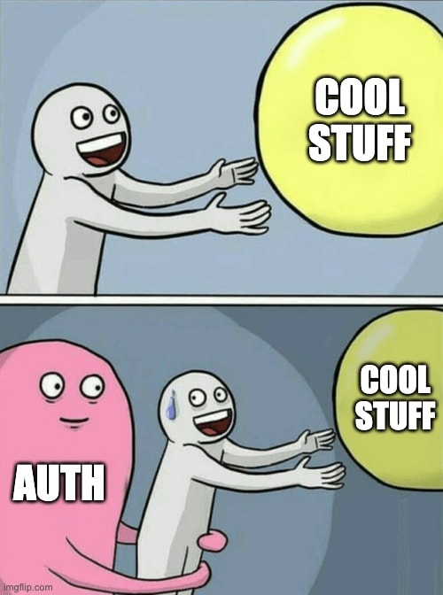

[ChatGPT](https://chat.openai.com/) is an interesting tool. It makes certain things that used to be hard to do pretty easy.  In some cases, it introduces new concepts you may not have thought to do before.

OpenAI provides some sdks to help build on top of ChatGPT.

In this post, we'll take a simple idea implemented using ChatGPT and deploy it. In a follow-up post, we'll look at how to operate the application in production. We will also look at how to overcome some of the challenges of using ChatGPT in a live application.

> Please note: In these posts we end up signing up to various services. All but OpenAI have free plans. OpenAI has a free trial but does cost money when the free trial expires.

## Our Sample App

In the [DeeplearningAI Prompt Engineering Course](https://www.deeplearning.ai/short-courses/chatgpt-prompt-engineering-for-developers/), there is a section on summarising content.

This is an interesting function and one that would be quite tricky to do without using an LLM or some form of [NLP](https://en.wikipedia.org/wiki/Natural_language_processing).

In our sample application, we will use the [NYTimes API](https://developer.nytimes.com/apis) to pull in the top stories for today. We will get ChatGPT to summarise the stories and we will show that summary.

 The end result is available to view at: <https://summer-ui.fly.dev/>

The sample code for this is available in 2 repos:

- <https://github.com/ruarfff/summer-ui>
- <https://github.com/ruarfff/summer-api>

Feel free to ignore the UI code if you wish as it's only there to display the data pulled from our API.

## Tools

Our API is built using [FastAPI](https://fastapi.tiangolo.com/lo/) which is a Python web framework.

We can use the [NYTimes API](https://developer.nytimes.com/apis) to get some news and the [OpenAI API](https://platform.openai.com/docs/api-reference) to run ChatGPT.

We can deploy to [fly.io](https://fly.io/).

For the UI we'll use vanilla JavaScript, CSS and HTML.

[GitHub](https://github.com/) will make an appearance, with a section on building a deployment pipeline using [GitHub actions](https://github.com/features/actions). That will be in part 2.

We'll also end up using [Python](https://www.python.org/), [Docker](https://www.docker.com/) and [Git](https://git-scm.com/).

## Setup

Unfortunately, this full setup requires and lot of signing up for stuff and getting API Keys.



I hope you'll bear with me.

If you want a secure way to store these API keys locally, check out [my post on that](https://dev.to/ruarfff/managing-local-app-secrets-and-sharing-secrets-with-your-team-34m1).

### Get an NYTimes API Key

For this, follow the [NYTimes setup guide](https://developer.nytimes.com/get-started).

In short:

- [Go here](https://developer.nytimes.com/accounts/login), click Create Account (unless you already have one).
- Once logged in go to 'My Apps' and add a new app.
- Once you select the new app, you should see an API key.

Copy that API key and make it available in an environment variable called `NYTIMES_API_KEY`.

> Not sure what I mean by set an environment variable? Check out [this post](https://www.twilio.com/blog/how-to-set-environment-variables-html).

### Get a ChatGPT API Key

- Go to [the OpenAI API page](https://platform.openai.com/).
- Go to [API Keys](https://platform.openai.com/account/api-keys).

Once you have your key, add it to an environment variable called `OPENAI_API_KEY`.

> Note: OpenAI's API is a paid service. You will get a free trial when you sign up. If, like me, you signed up ages ago, forgot about it and have lost your free trial, you will need to add a payment method. Everything I did while testing this stuff cost about 5 cents but I added 5 euros to my account. Hopefully, you have the free trial.

### Fly.io

If you want to make something available on the internet you need to deploy it somewhere. There are a vast number of options. Fly.io is one that is currently free. You can also setup a free database and even a free redis cache.

Sign up for a free account at <https://fly.io/>. That's all you need for now.

## Creating the App

This is a step-by-step guide. You could skip this whole section, pull down the sample code and run it. If you would like a deeper explanation of all the bits though, read on.

### FastAPI App

We're going to use Python for the backend API. FastAPI is a nice framework. Both OpenAI and NYTimes provide Python packages for interacting with their APIs.

This, again, is a step with many options. The following is one way to go about doing it.

Create a directory for your project. I called my app Summer because it sounds like summarise  ¯\\\_(ツ)_/¯

Call yours whatever you wish but replace `summer` in the various examples.

I like to use a directory, under my home directory, called `dev` and put my repos in there.

> Note: All these commands assume you're using a reasonable shell (not Cmd.exe).

```shell
mkdir ~/dev/summer-api
cd ~/dev/summer-api
```

I'm using the `-api` suffix here because I want to keep my backend and frontent in two different repositories.

Initialize git so we can keep our changes in source control.

```shell
git init
```

You must have Python installed on your system. I'm currently using Python 3.11 but most versions from 3.8 on should be fine. Consider using [pyenv](https://github.com/pyenv/pyenv) to manage your Python installations if you don't already.

Install [poetry](https://python-poetry.org/):

```shell
pip install poetry
```

We'll use poetry as it simplifies dependency management and makes it easier to run [virtual environments](https://docs.python.org/3/library/venv.html).

Setup our python project with poetry:

```shell
poetry init
```

You will be asked for various inputs. Most of them are obvious. The main thing is to match the dependnecies.

```shell
Package name [summer-api]:
Version [0.1.0]:
Description []:  Summarising the news!
Author [Your name here, n to skip]:  Your name
License []:  MIT
Compatible Python versions [^3.11]:

Would you like to define your main dependencies interactively? (yes/no) [yes]

```

You can add dependencies during the init or just skip that and paste the dependencies listed below into the `pyproject.toml` file resulting in this:

```toml
[tool.poetry]
name = "summer-api"
version = "0.1.0"
description = "Summarising the news!"
authors = ["Your name"]
license = "MIT"
readme = "README.md"
packages = [{include = "summer_api"}]

[tool.poetry.dependencies]
python = "^3.11"
fastapi = "^0.95.2"
uvicorn = {extras = ["standard"], version = "^0.22.0"}
pynytimes = "^0.10.0"
openai = "^0.27.7"
fastapi-cache2 = "^0.2.1"
redis = "^4.5.5"

[tool.poetry.group.dev.dependencies]
httpx = "^0.24.1"
pytest = "^7.3.1"
black = "^23.3.0"

[build-system]
requires = ["poetry-core"]
build-backend = "poetry.core.masonry.api"
```
Feel free to update the versions although they will not be guaranteed to work with the code in this post.

Make sure to run `poetry install` if you manually update the `pyproject.yml` file.

Create a directory for our source code.

```shell
mkdir app
```

Create a main file.

```shell
touch app/__init__.py
touch app/main.py
```

Open `app/main.py` in an editor and enter the following:

```python
from fastapi import FastAPI

app = FastAPI()


@app.get("/")
def index():
    return {"msg": "Welcome to the News App"}
```

Run the app:

```shell
poetry run uvicorn app.main:app --reload
```

You should see output like this:

```shell
INFO:     Will watch for changes in these directories: ['~/dev/summer-api']
INFO:     Uvicorn running on http://127.0.0.1:8000 (Press CTRL+C to quit)
INFO:     Started reloader process [29115] using WatchFiles
INFO:     Started server process [29144]
INFO:     Waiting for application startup.
INFO:     Application startup complete.
```
You can go to <http://localhost:8000/> in your browser or hit it with curl e.g.

```shell
curl http://localhost:8000
{"msg":"Welcome to the News App"}
```

### Get top stories from NYTimes

Create a client:

```shell
touch app/nytimes_client.py
```

In that file, setup a call to get today's top stories:

```python
import os

from pynytimes import NYTAPI
# This is the API Key we setup and added to the env earlier
API_KEY = os.getenv("NYTIMES_API_KEY", "")
nyt = NYTAPI(API_KEY, parse_dates=True)


def get_top_stories():
    return nyt.top_stories()
```

To test it out, let's create and endpoint that simply returns the top stories.

In our `app/main.py` file import our new module:

```python
from .nytimes_client import get_top_stories
```

Add a new endpoint:

```python
@app.get("/news")
def news():
    return get_top_stories()
```

Run the app and test it (if the app was already running, the `--reload` flag will have made it restart so you don't have to run it again).

```shell
curl http://localhost:8000/news
```

If you have [jq](https://stedolan.github.io/jq/) installed you can use it to make the output look nicer.

```shell
curl http://localhost:8000/news | jq
```

You should get a pretty big output here with a list of stories and lots of content.

### Summarise the news

Now we'll introduce ChatGPT.

Create a new file:

```shell
touch app/summariser.py
```

The code in this file is explained using inline comments.

~~~python
import os

import openai

# You will need to get your API key from https://platform.openai.com/account/api-keys
openai.api_key = os.getenv("OPENAI_API_KEY")


# Got this function from this amazing course https://www.deeplearning.ai/short-courses/chatgpt-prompt-engineering-for-developers/
def get_completion(prompt, model="gpt-3.5-turbo"):
    messages = [{"role": "user", "content": prompt}]
    response = openai.ChatCompletion.create(
        model=model,
        messages=messages,
        temperature=0,  # this is the degree of randomness of the model's output
    )
    return response.choices[0].message["content"]


def summarise_news_stories(stories):
    """
    Takes in a list of news stories and prompts ChatGPT to
    generate a short summary of each story based on the provided
    Section, Subsection, Title, and Abstract.
    The function returns the summary generated by ChatGPT.

    Args:
    - stories (str): A list of news stories to be summarised.
    Each story should be a block of text with the following format
    where each part is on a newline:

    Section: the section
    Subsection: the subsection
    Title: the title
    Abstract: the Abstract

    The values for 'Subsection' and 'Abstract' can be empty
    strings if not applicable.

    Returns:
    - summary (str): A string containing the summary generated by ChatGPT
    for all the news stories.
    """

    print("Beginning summary")
    prompt = f"""
    Your task is to generate a short summary of a series of
    news stories given the Section, Subsection, Title and
    Abstract, of each story.

    The sections are after the 'Section:'.
    The subsections are after the 'Subsection:'. The subsections can be empty.

    The title is after the 'Title:'. The abstract is after the 'Abstract:'.
    The abstract can be empty.

    Summarise the stories below, delimited by triple backticks,
    in the style of an AI trying to convey information to humans.
    Please use paragraphs where appropriate and use at most 800 words.

    Stories: ```{stories}```
    """

    return get_completion(prompt)
~~~


### Formatting the stories

While we could probably have gotten ChatGPT to figure out the JSON from the NYTimes API, it's no harm to reduce the amount of stuff we send to it so let's format the stories to send to ChatGPT.

Create another file:

```shell
touch app/story_formatter.py
```

Add a function to that file to format the stories so we only send the content we need:

```python
def format_stories_to_string(stories):
    stories_string = ""
    for story in stories:
        title = story["title"]
        abstract = story["abstract"]
        section = story["section"]
        subsection = story["subsection"]
        stories_string += f"""
        Section: {section}
        Subsection: {subsection}
        Title: {title}
        Abstract: {abstract}
        """
    return stories_string
```

### The news endpoint

Now we can put everything together. Update our `app/main.py` file to look like the following:

```python
import os

from fastapi import FastAPI, HTTPException

from .nytimes_client import get_top_stories
from .story_formatter import format_stories_to_string
from .summariser import summarise_news_stories

app = FastAPI()


@app.get("/")
def index():
    return {"msg": "Welcome to the News App"}


@app.get("/news")
def news():
    summary = ""
    images = []
    try:
        stories = get_top_stories()
        for story in stories:
            images.extend(story["multimedia"])
        summary = summarise_news_stories(format_stories_to_string(stories))
        images = list(
            filter(lambda image: image["format"] == "Large Thumbnail", images)
        )
    except Exception as e:
        print(e)
        raise HTTPException(
            status_code=500, detail="Apologies, something bad happened :("
        )
    return {"summary": summary, "images": images}
```

You can now test it out but note, the call to ChatGPT takes a very long time. We will look at how to deal with that issue in part 2 of this series.

```shell
curl http://localhost:8000/news
```

This should output a summary of the news as well as a list of all the related images.

There's another step we need before we setup a UI for this. Our API expects any calls in the browser to come from the same URL as our application. This is a security mechanism called [Cross-Origin Resource Sharing (CORS)](https://developer.mozilla.org/en-US/docs/Web/HTTP/CORS). We need to update our API to allow requests from our UI.

To make that work, in our `main.py` add and configure the CORS middleware:

```python
from fastapi.middleware.cors import CORSMiddleware

app.add_middleware(
    CORSMiddleware,
    allow_origins=["*"],
    allow_credentials=True,
    allow_methods=["*"],
    allow_headers=["*"],
)
```

> Note: for `allow_origins=["*"],` you may want to be very specific once you know the URL your UI is at e.g. `allow_origins=["http://localhost:8080"],`. Using the wildcard here to reduce the chances of things going wrong while following these steps.

### Setup our UI

This is totally optional so we will quickly go through the steps.

```shell
mkdir ~/dev/summer-ui
cd  ~/dev/summer-ui
git init
mkdir app
touch app/index.html
touch app/script.js
touch app/style.css
```

In the `app/index.html` file:

```html
<!DOCTYPE html>
<html>
<head>
    <title>Today's News</title>
    <link rel="stylesheet" type="text/css" href="styles.css">
    <meta http-equiv="Content-Security-Policy" content="upgrade-insecure-requests" />
</head>
<body>
    <main>
        <div id="loader">
            <h1>This should be quick, but ever so often it takes a long time...</h1>
            <div class="lds-circle"><div></div></div>
        </div>
        <div id="news-container" class="container hidden">
            <h1>Today's News</h1>
            <div class="date" id="date"></div>
            <p id="summary">
            </p>
        </div>
        <div id="images" class="img-container">
        </div>
    </main>
    <script src="script.js"></script>
</body>
</html>
```

I am not good at CSS so I used ChatGPT to create some of this. I prompted it with:

> Can you make some CSS that shows a bunch of images, defined in html img elements, and displays them like a bunch of physical photographs that have been spread out on a table?

It output some of the following which I have modified in places.

In the `app/style.css` file:

```css
body {
  margin: 0;
  padding: 0;
  font-family: Arial, sans-serif;
  color: #333;
  line-height: 1.6;
  background: rgb(238, 174, 202);
  background: radial-gradient(
    circle,
    rgba(238, 174, 202, 1) 0%,
    rgba(148, 187, 233, 1) 100%
  );
}

.container {
  width: 80%;
  max-width: 800px;
  margin: 0 auto;
  padding: 20px;
  background-color: #fff;
  box-shadow: 0px 0px 20px rgba(0, 0, 0, 0.1);
  padding-bottom: 4rem;
}

h1 {
  font-size: 2em;
  margin-bottom: 0.5em;
  color: #212121;
  text-align: center;
}

p {
  font-size: 1em;
  text-align: justify;
}

/* Media queries for responsive design */
@media (max-width: 768px) {
  /* Tablets */
  .container {
    width: 90%;
  }

  h1 {
    font-size: 1.75em;
  }

  p {
    font-size: 0.9em;
  }
}

@media (max-width: 480px) {
  /* Phones */
  .container {
    width: 95%;
  }

  h1 {
    font-size: 1.5em;
  }

  p {
    font-size: 0.85em;
  }
}

.img-container {
  display: flex;
  flex-wrap: wrap;
  justify-content: center;
}

.photo {
  position: relative;
  margin: -15px; /* negative margin makes the images overlap */
  transform: rotate(-10deg); /* starting angle */
  box-shadow: 0 0 10px rgba(0, 0, 0, 0.5);
  transition: transform 0.5s;
  z-index: 1; /* ensure that images can stack on top of each other */
}

.photo:hover {
  transform: rotate(0deg); /* reset to straight when hovered */
}

.photo img {
  max-width: 150px;
  border-radius: 10px;
}

.date {
  text-transform: uppercase;
  text-align: center;
}

#loader {
  padding-top: 20%;
  text-align: center;
}

.lds-circle {
  display: inline-block;
  transform: translateZ(1px);
}
.lds-circle > div {
  display: inline-block;
  width: 64px;
  height: 64px;
  margin: 8px;
  border-radius: 50%;
  background: #fff;
  animation: lds-circle 2.4s cubic-bezier(0, 0.2, 0.8, 1) infinite;
}
@keyframes lds-circle {
  0%,
  100% {
    animation-timing-function: cubic-bezier(0.5, 0, 1, 0.5);
  }
  0% {
    transform: rotateY(0deg);
  }
  50% {
    transform: rotateY(1800deg);
    animation-timing-function: cubic-bezier(0, 0.5, 0.5, 1);
  }
  100% {
    transform: rotateY(3600deg);
  }
}

.hidden {
  display: none;
}
```

In the `app/script.js` file:

```javascript
window.onload = function () {
  fetch("https://summer-api.fly.dev/news/")
    .then((response) => response.json())
    .then((data) => {
      document.getElementById("loader").style.display = "none";
      document.getElementById("news-container").style.display = "block";

      const summaryElement = document.getElementById("summary");
      const imagesElement = document.getElementById("images");

      summaryElement.innerHTML = data.summary.split("\n").join("<br>");

      data.images.forEach((image, index) => {
        const img = document.createElement("img");
        img.className = "photo";
        img.src = image.url;
        img.alt = image.caption;
        img.style.width = "150px";
        img.style.height = "150px";

        if (index % 3 === 0) {
          img.style.gridColumnEnd = "span 2";
          img.style.gridRowEnd = "span 2";
        }

        imagesElement.appendChild(img);
      });
    })
    .catch((err) => console.error(err.message));

  function formatDate(date) {
    const options = {
      weekday: "long",
      month: "long",
      day: "numeric",
      year: "numeric",
    };
    return date.toLocaleDateString("en-US", options);
  }

  const today = new Date();
  document.getElementById("date").textContent = formatDate(today);
};

```

> Note: make sure to replace the URL in that script with whatever URL your API is at

Now you can serve that directory e.g. using the [Live Server in VSCode](https://marketplace.visualstudio.com/items?itemName=ritwickdey.LiveServer) or using some other utility e.g. [serve](https://www.npmjs.com/package/serve).

All going well you'll see a page like this:


## Deploying to fly.io

Let's start with the backend.

First, install flyctl <https://fly.io/docs/hands-on/install-flyctl/>

Login:

```shell
fly auth login
```

Go to our API directory:

```shell
cd ~/dev/summer-api
```

The easiest way to deploy a service is by using a Dockerfile to define the environment. If you can build and run it locally it'll probably work when deployed.

Create a Dockerfile.

```shell
touch Dockerfile
```

With this content:

```docker
FROM python:3.11 as builder
WORKDIR /tmp

RUN pip install poetry

COPY ./pyproject.toml ./poetry.lock /tmp/

RUN poetry export -f requirements.txt --output requirements.txt --without-hashes

FROM python:3.11

WORKDIR /usr/app

COPY --from=builder /tmp/requirements.txt ./requirements.txt

RUN pip install --no-cache-dir --upgrade -r ./requirements.txt

COPY . .

EXPOSE 8080

CMD ["uvicorn", "app.main:app", "--host", "0.0.0.0", "--port", "8080"]
```

Test it out:

```shell
docker build . -t summer-api
docker run -p 8080:8080 summer-api
```
You should be able to hit your application at <http://localhost:8080>.

Fly knows how to deploy a Dockerfile.

```shell
fly launch
```

That will guide you through setting up your app.

We also need to give it our API keys.

```shell
flyctl secrets set NYTIMES_API_KEY=${NYTIMES_API_KEY}
flyctl secrets set OPENAI_API_KEY=${OPENAI_API_KEY}
```

All going well your API should be up an running. Mine for example is here: <https://summer-api.fly.dev/>

You will have a unique URL for your app.

For the UI we can do something similar.

```shell
cd ~/dev/summer-ui
```

First, update the script in the UI so it points to the new URL for your API.

So this bit:
```javascript
window.onload = function () {
  fetch("https://summer-api.fly.dev/news/")
```

There, you should replace `"https://summer-api.fly.dev/news/"` with your URL.

Then create a Dockerfile:

```shell
touch Dockerfile
```

Add the following content to the Dockerfile:

```shell
FROM pierrezemb/gostatic
COPY ./app/ /srv/http/

EXPOSE 8043
```

`8043` happens to be the port that image uses by default.

Run fly:

```shell
fly launch
```

Fly launch creates a file in your repo called fly.toml.

I hit an issue where I needed to update that file to the following in my UI because it defaulted to the wrong port:

```toml
app = "summer-ui"
primary_region = "cdg"

[http_service]
  internal_port = 8043
  force_https = true
  auto_stop_machines = true
  auto_start_machines = true
  min_machines_running = 0
```

You may or may not need this. Make sure to update the `app` and `primary_region` to the correct values for your app.

## Improvements

This post is already huge so I will put all the improvements into their own post.

In the next post we'll look at:

- setting up a continuous delivery pipeline
- use redis to cache ChatGPT responses and speed up our site

Thank you for reading!
