Codeship provides some docs on how to set up a deployment to AWS (Amazon Web Services) EB (Elastic Beanstalk) [here](https://documentation.codeship.com/basic/continuous-deployment/deployment-to-elastic-beanstalk/). I didn't find them great since they assumed a lot of knowledge I didn't have. I know I'll have to do this again so here I am writing down all the steps I had to follow to get this to work.

_Disclaimer: I can't claim any of this is best practice. Just what I figured out as I went along. I don't run critical large scale applications on AWS. Just simple apps and side projects._

For this first step I will be deploying a simple nodejs application using the pre-configured Node.js platform on EB. The instructions should be basically the same for any other platform on EB though.

## Assumptions

- You're using Codeship or some other similar CI (Continuous Integration) system (that system should allow you to configure an EB deployment as we won't be looking in to how to deploy with the aws tools directly).
- You have an [AWS](http://aws.amazon.com) account and are aware of pricing etc. If you're in your free trial this should all be free but might cost you a little otherwise.
- You have the ability to add a user with [IAM](https://aws.amazon.com/iam/).
- You can create an EB application.

## Checklist

Here's the steps we will have gone through by the end of this post.

1. Create an Elastic Beanstalk application & environment
2. Configure IAM with a deployment user and user group
3. Configure a deployment pipeline

I am going to use the AWS UI for all this.

**Account ID and region**

When working with AWS there are 2 values you will have that will likely be different to what I have here. Your account ID and your region. For the rest of this post, rather than calling out these in each place I am just going to use these values:

AccountID: `123456789123`
Region: `eu-west-1`

In all the examples I have, just replace these values with your own.

You can find your account ID by selecting the dropdown with your name on the top right and viewing you account which should be at this URL: https://console.aws.amazon.com/billing/home?#/account

## 1. Create an Elastic Beanstalk application & environment

Go to your console and select Elastic Beanstalk in the services section. If your currently selected region is eu-west-1 and this is your first time creating an EB app, you will end up at a URL like this https://eu-west-1.console.aws.amazon.com/elasticbeanstalk/home?region=eu-west-1#/getting_started

Don't use the default stuff in there. Instead use the `Create New Application` link on the top right.

If it's not your first time creating one, click the create new app link anyway to follow along.

You will see a dialog prompting you to enter application details. Enter whatever you want there.

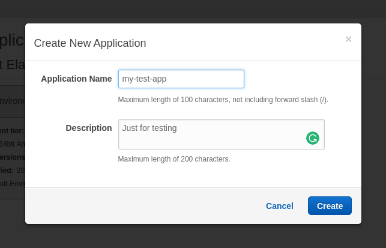

You will end up at the screen listing any application you have created.

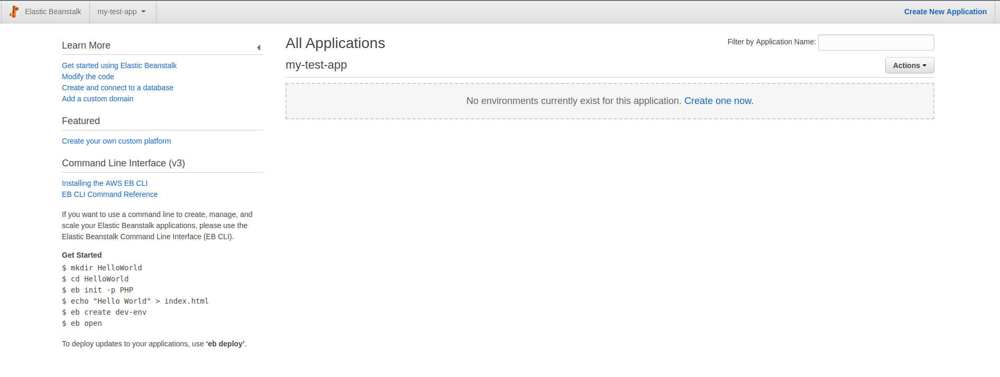

Select the option to create a new environment for your application, either in the Actions dropdown or by clicking the `Create one now` link.

Choose the Web Server option.

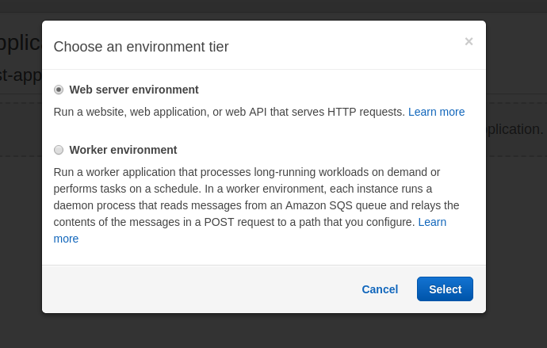

Fill in the form.

For this example we will use the Node.js pre-configured platform. You can use the Sample application option for Application code. We will overwrite that soon.


Click the Create button and wait for you environment to be created.


This will take a while to complete.

AWS provides you with a public URL (as you saw in the create env form) so once your environment is up an running you can access it in the browser. In my case I saw this.

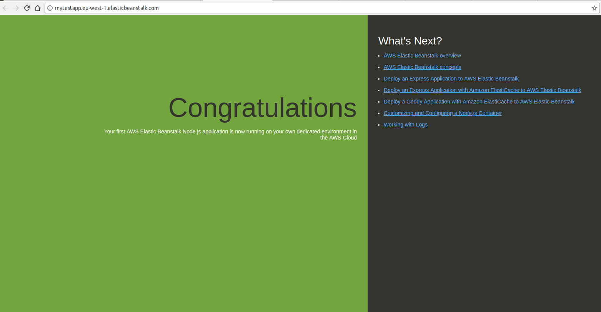

If you go back to the EB view you can see the application health and there's even a button to upload new code to EB. If you didn't want a deployment pipeline you could just use that button.

### Optional - add RDS

Just to go over how to add and use another service in EB, we will add a MySQL database to our app. This will be similar for whatever else you might want to add. I only picked RDS with MySQL since it's very simple.

Go to the configuration tab for you application.


Scroll down for the database card and click `Modify`. You will be presented with a form to create a new database. You can fill in the form similarly to how I have below. I have chosen the cheapest options as I will be deleting all this soon after.

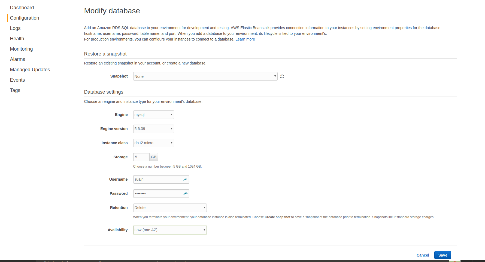

Once you click Save, be sure to click Apply on the next screen.

Worth noting, if you already have a database in AWS, you can bind that instead of creating a new one if you wish.

You can also just access any database from your app as normal but there are some advantages to using the binding in EB. One being that you get some environment variables injected so that your app can use them to connect to the database

For RDS these are:

```
RDS_HOSTNAME
RDS_PORT
RDS_USERNAME
RDS_PASSWORD
RDS_DB_NAME
```

For other services you get similar things so it's really handy. You don't need to worry about securely distributing credentials to your application yourself.

### Step 1 done

Now we have our EB application ready to use. This will have created an EC2 instance to host our application with Node.js setup. We also happen to have a load balancer and auto-scaling which are nice things to have although we won't use them here. You could have chosen a single instance deployment too.

Next we'll look at setting up a user and user group to allow our CI system permissions for deploying our application.

## 2. Configure IAM with a deployment user and user group

For this we want to create a user group that has the correct permissions to deploy to our EB application. We will create a user for CodeShip to use. We will also set up some policies that give just enough permissions for that user group.

In this section we will:

- Create a policy for S3 access
- Create a policy for EB access
- Create a deployment user group and attach the policies we created
- Create a deployment user for CodeShip and add them to the deployment user group

### Create a policy for EB access

Go to the [IAM](https://console.aws.amazon.com/iam/home) service in your AWS console. Click on the `Policies` link on the left.

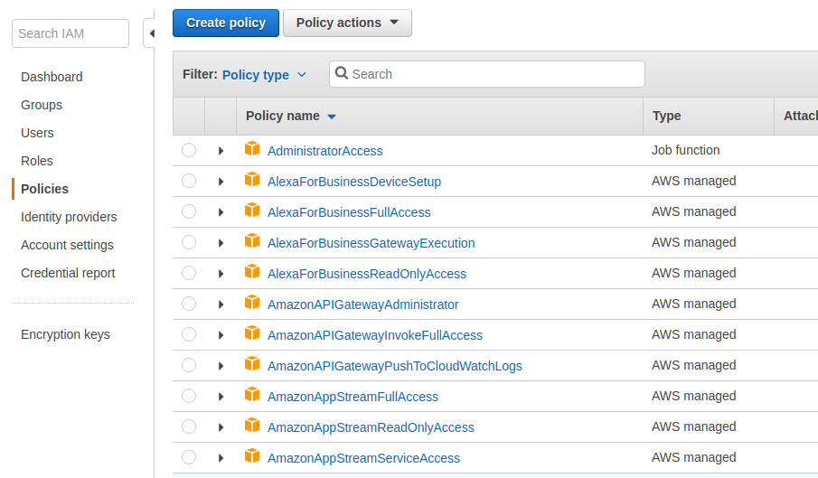

Click the `Create Policy` button. Select the JSON tab like below.


Insert the following JSON, replacing my region and account ID with yours.

```
{
    "Version": "2012-10-17",
    "Statement": [
        {
            "Effect": "Allow",
            "Action": [
                "autoscaling:ResumeProcesses",
                "elasticloadbalancing:RegisterTargets",
                "autoscaling:SuspendProcesses",
                "elasticloadbalancing:DeregisterTargets",
                "elasticbeanstalk:CreateApplicationVersion",
                "elasticbeanstalk:DeleteApplicationVersion",
                "ec2:DescribeImages",
                "elasticbeanstalk:DescribeEnvironments",
                "autoscaling:DescribeScalingActivities",
                "autoscaling:DescribeAutoScalingGroups",
                "elasticloadbalancing:DescribeTargetHealth",
                "elasticbeanstalk:UpdateEnvironment",
                "elasticloadbalancing:DescribeInstanceHealth",
                "ec2:DescribeKeyPairs",
                "elasticloadbalancing:DeregisterInstancesFromLoadBalancer",
                "elasticloadbalancing:RegisterInstancesWithLoadBalancer"
            ],
            "Resource": "*"
        },
        {
            "Effect": "Allow",
            "Action": [
                "sns:ListSubscriptionsByTopic",
                "sns:GetTopicAttributes",
                "sns:CreateTopic",
                "cloudformation:DescribeStackResources",
                "s3:CreateBucket",
                "s3:ListBucket",
                "cloudformation:DescribeStackResource",
                "s3:GetBucketPolicy",
                "s3:PutObject",
                "s3:GetObjectAcl",
                "s3:GetObject",
                "cloudformation:GetTemplate",
                "cloudformation:UpdateStack",
                "sns:Subscribe",
                "s3:DeleteObject",
                "s3:PutObjectAcl"
            ],
            "Resource": [
                "arn:aws:sns:eu-west-1:123456789123:*",
                "arn:aws:s3:::elasticbeanstalk-eu-west-1-123456789123",
                "arn:aws:s3:::elasticbeanstalk-eu-west-1-123456789123/*",
                "arn:aws:cloudformation:eu-west-1:123456789123:*"
            ]
        }
    ]
}
```

Click review policy and fill out the next form. Fill in detail that make sense to you and will make it easy to find the policy later.


### Create a deployment user

In the IAM console, click the Users link on the left menu and click the Add user button.

Create a user to use in your CI system (I am calling mine codeship-deployer since I am using CodeShip). Select the Programmatic access option.


### Create a deployment user group

Rather than give the user permissions directly, it can make sense to use a user group instead. This makes life a little easier if you end up wanting to add more CI systems with their own users or something like that.

In the IAM console, click the Groups option on the left. Click the Create New Group button.

Give the group a sensible name. I just called mine Deployment.

In the user group menu, select the Permissions tab and click Attach Policy.


Find the policies we created earlier and attach them.

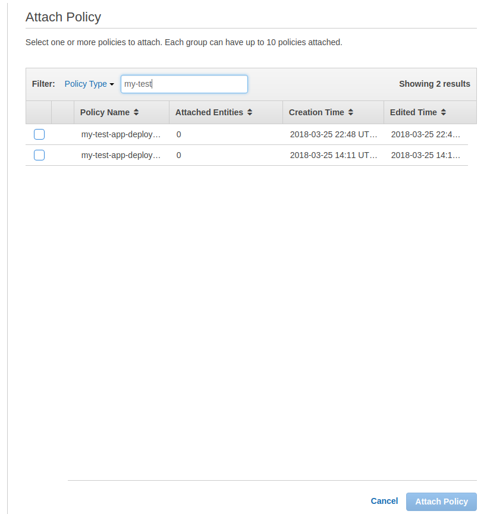

### Access Keys

Before we go on to the next step, you will need to get access keys for the user we created. For this, select the user by clicking on any hyperlink with the user name or navigating to the user in the users menu. Select the Security credentials tab for the user You should end up at a URL like this https://console.aws.amazon.com/iam/home?region=eu-west-1#/users/codeship-deployer?section=security_credentials

Click on `Create Access Key`. You will be shown an Access key ID and Secret access key. Keep this for the next step where we will configure our pipeline and will have to provide these keys.


## 3. Configure a deployment pipeline with CodeShip

I will be using CodeShip specifically here but I guess the instructions would be reasonably similar for other tools too. I am going to assume you have a project setup and all you have left to do is configure a deployment. Select the deploy option in project settings and select Amazon ELastic Beanstalk.

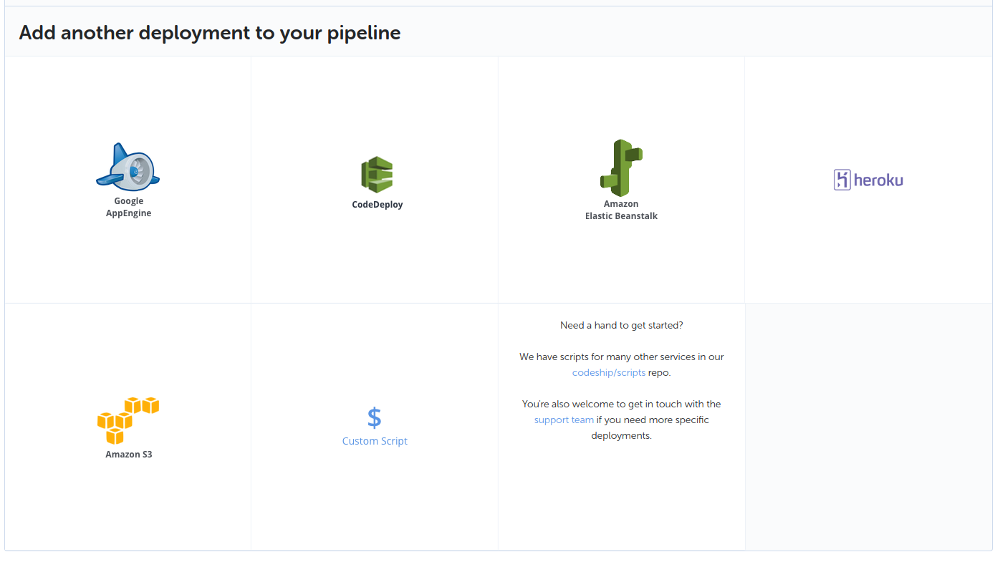

You will be shown a form to fill in. If you have followed along so far you should have all the values you need for this ready to go. Fill in the form similar to what I have here.

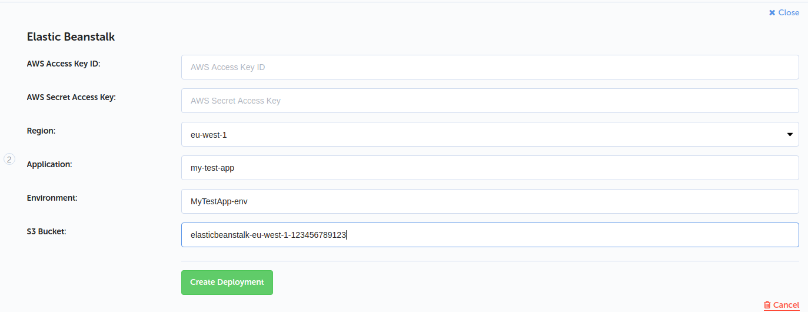

The `AWS Access Key ID` and `AWS Secret Access Key` are the keys we generated for the deployment user. The `Region` is whatever region you created your EB stuff in. The `Application` is the name of the EB application we created. The `Environment` is the name of the environment we created for the application. The `S3 Bucket` is the name of the bucket being used by EB to store application resources.

Now you can run your deployment pipeline. You probably need to push something to the branch you have configured to deploy.

**One little gotcha**

The first time I ran my pipeline I go this.

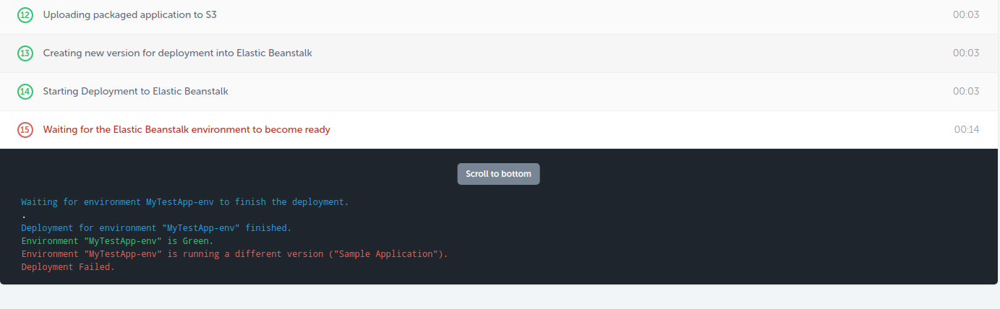

To fix it I went in to the deployment menu in my EB app, removed the sample app and deployed the new app that Codeship had put there. The pipeline worked from then on. I presume I missed some step somewhere or perhaps I should have uploaded the app I was going to deploy in the earlier steps instead of selecting the Sample App.

## Testing things out

Your app should now be available to test. For me the public URL for my app was here.

mytestapp.eu-west-1.elasticbeanstalk.com

For you it will be the name of you app without hyphens + your region + .elasticbeanstalk.com

Hit the URL to make sure the app is running.

You can go in and check out application logs.

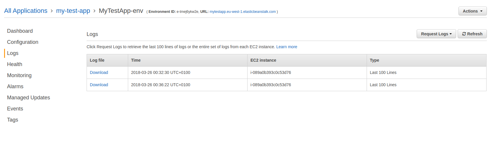

If I hit issues deploying my app, I usually add a bunch of logging for things like the database connection or any other environment specific stuff and can check what is being picked up in those logs. Haven't come up with a better way than that yet.

That's it. I hope it all worked out for you and you were able to get a deployment pipeline going. Please feel free to give any feedback or ask any questions in the comments section below.
