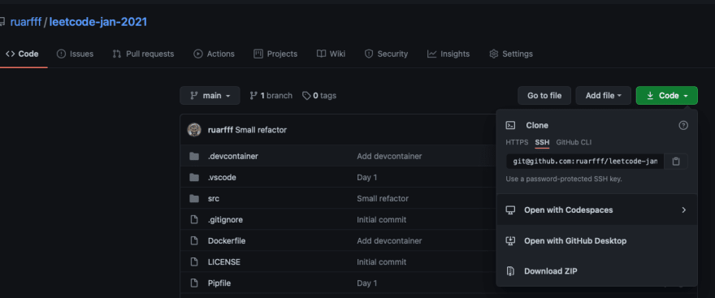
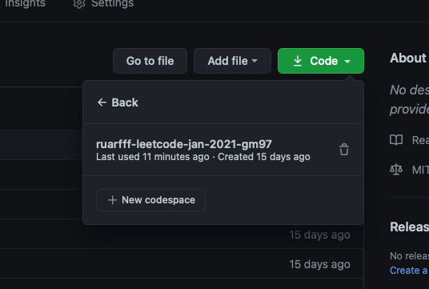
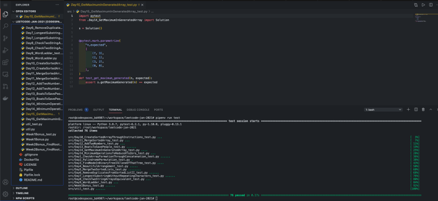
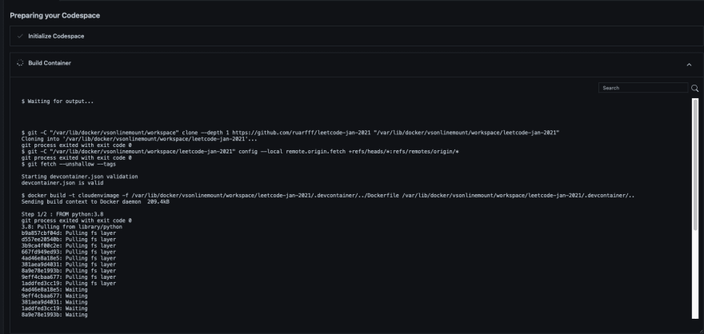

A while back I started using [Devcontainer](https://code.visualstudio.com/docs/remote/devcontainerjson-reference) in [VsCode](https://code.visualstudio.com). I really liked the editor integration and if you're in a team, being able to share the development environment like this is great. We have been able to do this for a while now with [docker](https://www.docker.com/) or even [vagrant](https://www.vagrantup.com) but getting a nice editor abstraction makes it easier to adopt.

I recently got access to [Codespaces](https://github.com/features/codespaces) and discovered it also supports this setup.

I am using it for [this python repo](https://github.com/ruarfff/leetcode-jan-2021). There is also [a more detail official example](https://github.com/microsoft/vscode-remote-try-python).

If you don't have access to Codespaces you can [request early access](https://github.com/features/codespaces/signup) - note that link may not age well.

If you have access, you should see an option in the GitHub UI:



If you have not setup this repo before, you will be asked to create a new Codespace. After that, you will have a link to the space like this:



Then you basically have VSCode in the browser:



You don't need any extra setup for this to work. You will get a handy development environment that persists so you can open it up on any machine with a browser without needing to install any extra development tools. You can work on one machine and move to another no problem.

What if you want to customise the setup? That's where devcontainer comes in. For my example repo, I wanted to use python 3.8 and I wanted pipenv to be installed. This is how I set that up.

## Docker Setup

You can define the environment you want to use for development with a dockerfile. My docker file it really basic but you can do whatever you need here:

```docker
FROM python:3.8

RUN  pip install pipenv
```

I put this at the root of the project in a file called `Dockerfile`.

For Codespaces to use this you need one more step.

Create a file: `.devcontainer/devcontainer.json`

```json
{
  "name": "Docker Setup",

  // Sets the run context to one level up instead of the .devcontainer folder so we can keep Dockerfile at the root.
  "context": "..",

  // Set *default* container specific settings.json values on container create.
  "settings": {
    "terminal.integrated.shell.linux": null
  },

  "extensions": [],

  "postCreateCommand": "pipenv sync --dev",

  "runArgs": ["--network", "host"]
}
```

I like having the Dockerfile at the root of my project so I configured it that way but it's also quite common to put the Dockerfile in the `.devcontainers` directory.

`"terminal.integrated.shell.linux": null` just says we don't want to use my local VSCode shell settings since your own VSCode settings get imported if you are using settings sync. You can configure this to be more specific based on what's in your Dockerfile.

I want to use [pipenv](https://pypi.org/project/pipenv/) so having this run post creation `"postCreateCommand": "pipenv sync --dev"` saves one extra step.

`"runArgs": [ "--network", "host"]` because I don't want to bother messing with ports.

With all that setup, once you create a new Codespace, you should see it getting created like this:



Now you have an environment setup the way you want.

This is a very basic example but there's a lot more you can do.

## More Customisation

You will almost certainly want to look at [setting up GitHub dotfiles](https://docs.github.com/en/github/developing-online-with-codespaces/personalizing-codespaces-for-your-account) to customise the shell in Codespaces.

Checkout the many examples in the [vscode-dev-containers repo](https://github.com/microsoft/vscode-dev-containers/tree/master/containers).
