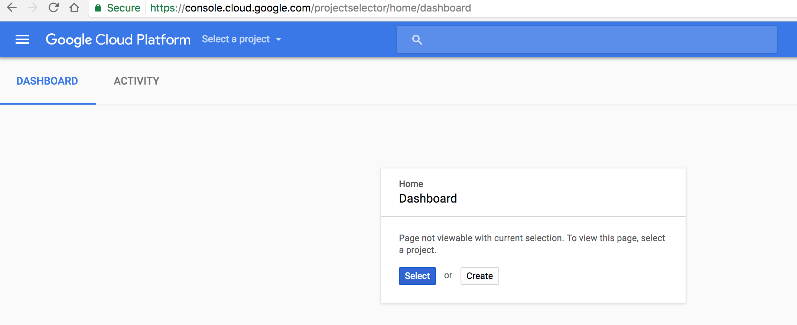
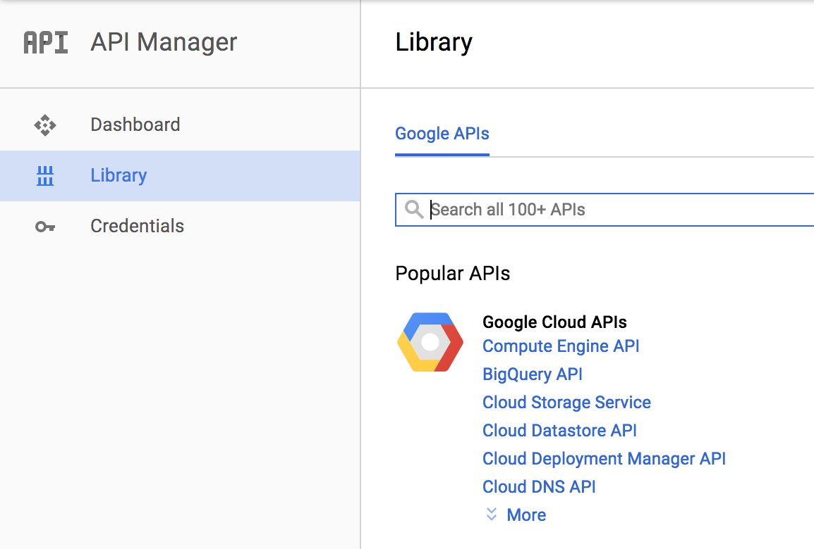
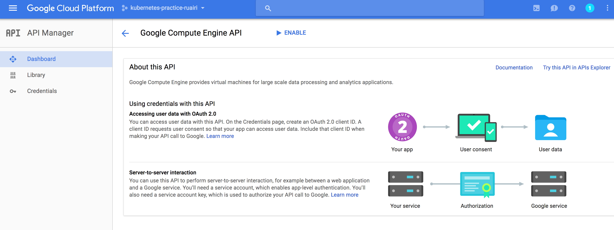
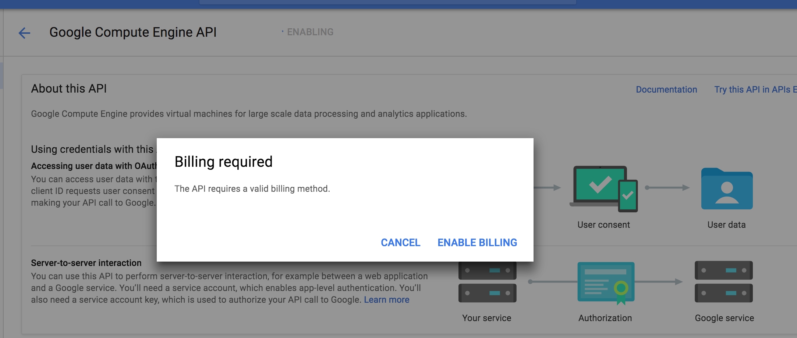

This post is a relatively short introduction to [Kubernetes](https://kubernetes.io/) looking at some of the basic features.

We will look at using kubernetes in two ways. With the Google Cloud Platform (GCP) with [GKE](https://cloud.google.com/kubernetes-engine/) and with minikube.

You can use one or the other or both, or indeed some other cloud provider but GCP and minikube are what we will use here. I recommend playing around with both GCP and minikube since it won't cost you anything. For GCP you need a Google account but you will also need a way to setup billing which pretty much means you will need a credit card. You won't have to spend money but you will need to have billing enabled in the GCP account.

### Install the GCP SDK

Instructions here are good and cover all platforms: <https://cloud.google.com/sdk/>

You can also just use the cloud console in the GCP UI but I will use `gcloud` in the examples here.

### Install kubectl

Assumes you have followed the instructions above and installed `gcloud`.

```bash

 gcloud components install kubectl

```

### Google Cloud Platform

You can just skip forward and setup minikube if you prefer but I recommend using this to have something a little more 'real'.

First you need a google account. Not much point me explaining how to do that I guess.

Then you will need to setup a GCP dashboard for yourself (if you haven't one already). Just open this link https://console.cloud.google.com/start and follow the instructions.



When on that page click the 'Create' button to create a project.

When selecting a name for your project try to use something globally unique to you. For example, for me I append my username.


Notice it says 'Your project ID will be {the ID}' and in my case the ID matches the name I specified.

Beware if you use a name that has already been used somewhere else in the world, like in this example:


You will get a random ID, which is a pain because whenever you need to use the ID you have to go digging for it (for some reason I keep forgetting where to find it) but the name is always visible in the UI and easier to remember.

Next you will want to go the the API manager dashboard.


Click 'Enable API' near the top of the page.


Select 'Compute Engine API' (click the link under Popular APIs or search for it in the unlikely event it's not visible).


Then click the blue Enable button near the top.


At this point you will likely be asked to setup billing (unless you have already setup billing with GCP before).


You will be offered a free trial but you still have to enter a credit card to get it. You don't really need the free trial for what we will be doing either but no harm setting it up.

#### Create a cluster in GCP

If you haven't authorized gcloud already, do so now like so:

```bash

gcloud auth login

```

That should open a browser window where you can login to your google account.

Now configure the project you created (PROJECT_ID should be replaced with the ID of your project):

```bash

gcloud config set project PROJECT_ID

```

Configure your desired zone like this:

```bash

gcloud config set compute/zone europe-west1-d

```

You can list the available zones with this command:

```bash

gcloud compute zones list

```

Verify the configuration like this:

```bash

gcloud config list core/project
[core]
project = kubernetes-practice-ruairi

Your active configuration is: [default]

```

Now create a cluster.

```bash

gcloud container clusters create my-cool-cluster

```

(probably pick a better cluster name)

Verify it's there.

```bash

gcloud container clusters list

```

You should see something like this.

```bash

NAME             ZONE           MASTER_VERSION  MASTER_IP       MACHINE_TYPE   NODE_VERSION  NUM_NODES  STATUS
my-cool-cluster  europe-west1-d 1.6.4           130.211.181.72  n1-standard-1  1.6.4         1          RUNNING

```

### minikube

Minikube basically lets you run kubernetes locally. Follow the instructions here to get it setup:
https://github.com/kubernetes/minikube

With minkube creating a clust is a little easier:

```bash

minikube start

```

You also have the added advantage of not needing to setup a GCP account and all that but it's only useful for developing stuff locally of course.

To make sure kubectl is pointing at minikube try this:

```bash

kubectl cluster-info
Kubernetes master is running at https://192.168.99.100:8443
KubeDNS is running at https://192.168.99.100:8443/api/v1/proxy/namespaces/kube-system/services/kube-dns
kubernetes-dashboard is running at https://192.168.99.100:8443/api/v1/proxy/namespaces/kube-system/services/kubernetes-dashboard

```

### Switching contexts in kubectl

If you end up using both GCP and mimikube, it's useful to easily switch contexts in kubectl

These commands help:

```bash

kubectl config get-contexts

```

```bash

kubectl config use-context ${context_name}

```

You can also set the context in each call:

```bash

kubectl <some options here> --context=minikube

```

### Deploy something

For this we can create a simple hello world application and put it in a container. Here's one I made earlier: <https://hub.docker.com/r/ruairitobrien/hello-kubernetes-world/>

Note, these instructions should work the same whether you are using GCP or minikube.

Code for that app is here but nothing interesting there really https://github.com/ruarfff/hello-kubernetes-world

```bash

kubectl run hello-kubernetes --image ruairitobrien/hello-kubernetes-world:latest

```

You should usually specify a version number so you have a history of deployed versions that you can switch to if needed but ':latest' will do for this tutorial.

You should see

```bash

deployment "hello-kubernetes" created

```

Verify it worked

```bash

$ kubectl get deployments
NAME               DESIRED   CURRENT   UP-TO-DATE   AVAILABLE   AGE
hello-kubernetes   1         1         1            1           1m

```

You can also check the pod that was created:

```bash

$ kubectl get pods
NAME                                READY     STATUS    RESTARTS   AGE
hello-kubernetes-3390701390-jds31   1/1       Running   0          1m

```

Pods are an important part of kubernetes but rather than me going on about them it's best to read up here: <https://kubernetes.io/docs/concepts/workloads/pods/pod/>

It's also useful to check out the describe functions. Most things have them.

```bash

kubectl describe deployment <deploymentName>

# Example
kubectl describe deployment hello-kubernetes

kubectl describe pods <podName>

# Example
kubectl describe pods hello-kubernetes-3390701390-jds31

```

### You have a deployment

Now that you have a deployment, what are you going to do with it?

I am just going to show a few simple things here to give you an idea of what's available. Most of this and much more can be found [https://kubernetes.io/docs/user-guide/kubectl-cheatsheet/](in these docs).

You will probably want to look at logs a bit. You can look at the logs for a pod with this.

```bash

kubectl logs <podName>

# Example
kubectl logs hello-kubernetes-3390701390-jds31

```

This will give you the logs for this instance of that pod. You can go more in detail, for example in the case where you have a pod with multiple containers. More on that [in the kubernetes docs](https://kubernetes.io/docs/user-guide/kubectl/v1.6/#logs).

Now let the world see your amazing app!

First, run get services.

```bash

kubectl get services
NAME         CLUSTER-IP    EXTERNAL-IP   PORT(S)   AGE
kubernetes   10.55.240.1   <none>        443/TCP   1h

```

You can see there is no external IP and no mention of the pod we created.

```bash

kubectl expose deployment hello-kubernetes --type LoadBalancer --port 80 --target-port=8000

```

Here we are using the load balancer option.

> LoadBalancer - Creates an external load balancer in the current cloud (if supported) and assigns a fixed, external IP to the Service. Superset of NodePort.

There are other types you can use.

> Type for this service: ClusterIP, NodePort, or LoadBalancer. Default is 'ClusterIP'.

We're using LoadBalancer because it's a nice option for us to play around with autoscaling soon.

`--port` is the port we are exposing our service on.

`--target-port` is the port our application in the Docker image happens to be exposed on.

Wait a minute or so for things to work out and then run this.

```bash

kubectl describe svc hello-kubernetes

```

You should see something like this.

```bash

Name:			hello-kubernetes
Namespace:		default
Labels:			run=hello-kubernetes
Annotations:		<none>
Selector:		run=hello-kubernetes
Type:			LoadBalancer
IP:			10.55.243.178
LoadBalancer Ingress:	104.154.182.255
Port:			<unset>	80/TCP
NodePort:		<unset>	31390/TCP
Endpoints:		10.52.0.5:8000
Session Affinity:	None

```

The 'Endpoints' value is the internal ip and port of your application running in the cluster.

This value: LoadBalancer Ingress: 104.154.182.255 is what we can use to talk to our application externally. Stick the ip address that you see there in your browser and you should see 'hello kubernetes world' or whatever you have your application sending back if you wrote your own there.

### Autoscaling

This for me was the first really cool thing I came across when playing around with kubernetes. Now our application is deployed, we can attach an autoscaler to it. Here is a command we can use to do that.

```bash

kubectl autoscale deployment hello-kubernetes --cpu-percent=1 --min=4 --max=12

```

Now we have attached an autoscaler.

`--cpu-percent` will try to average the utilization across all the pods to the percent we set i.e. will scale up until it hits the max amount of pods if cpu utilization goes above 10% on average across all existing pods. We set 1% for demonstration purposes so we have a chance of forcing the cluster to scale up when hitting it from our machine.

`--min` is the minimum amount of pods we want in the cluster.

`--max` is the maximum amount of pods we will allow the autoscaler to provision for us.

The autoscaler will scale up when cpu is above 10% on average. It will also scale down to the minimum when cpu utilisation is below average.

Try running this.

```bash

kubectl describe svc hello-kubernetes

```

You should see something like this.

```bash

Name:			hello-kubernetes
Namespace:		default
Labels:			run=hello-kubernetes
Annotations:		<none>
Selector:		run=hello-kubernetes
Type:			LoadBalancer
IP:			10.55.245.180
LoadBalancer Ingress:	104.198.145.117
Port:			<unset>	80/TCP
NodePort:		<unset>	32063/TCP
Endpoints:		10.52.0.5:8000,10.52.2.6:8000,10.52.2.7:8000,10.52.2.8:8000
Session Affinity:	None

```

Notice we now have 4 endpoints. You could see this with `kubectl get pods` too. The autoscaler has already scaled up to meet the minimum requirements we set.

To see the state of the autoscaler run this.

```bash

kubectl get hpa

```

You should see something like this.

```bash

NAME               REFERENCE                     TARGETS   MINPODS   MAXPODS   REPLICAS   AGE
hello-kubernetes   Deployment/hello-kubernetes   0% / 1%   4         12        4          1m

```

And just to confirm the number of pods is 4.

```bash

kubectl get pods
NAME                                READY     STATUS    RESTARTS   AGE
hello-kubernetes-3390701390-jds31   1/1       Running   0          3m
hello-kubernetes-3390701390-q1v74   1/1       Running   0          3m
hello-kubernetes-3390701390-txg9z   1/1       Running   0          3m
hello-kubernetes-3390701390-w6kjg   1/1       Running   0          47m

```

Now the fun part. Let's see autoscaling in action!

You probably have a better way of doing this (please comment with a suggestion) but what I did here was just run this.

```bash

while true; do curl -XGET ${IP} & done

# So for my cluster in the above examples that was

while true; do curl -XGET 104.198.145.117 & done

```

Or something a little safer perhaps.

```bash

for i in {1..1000}; do curl -XGET ${IP} & done

```

If you go down the safe route with a limited loop, the timing where you check the following things is important.

After a while you should start to see autoscaling kicking in:

```bash

kubectl get hpa
NAME               REFERENCE                     TARGETS   MINPODS   MAXPODS   REPLICAS   AGE
hello-kubernetes   Deployment/hello-kubernetes   3% / 1%   4         12        8          4m

```

You can see the 'TARGETS' ratio (that's the CPU utilisation) is grown above that which we specified. In my example it's 3% but the autoscaler wants it to be below 1% on average so it should start scaling up to bring that back in balance.

Check the new pods getting created.

```bash

kubectl get pods
NAME                                READY     STATUS    RESTARTS   AGE
hello-kubernetes-3390701390-1ght4   1/1       Running   0          39s
hello-kubernetes-3390701390-2gp0c   1/1       Running   0          39s
hello-kubernetes-3390701390-ddgv0   1/1       Running   0          39s
hello-kubernetes-3390701390-jds31   1/1       Running   0          4m
hello-kubernetes-3390701390-q1v74   1/1       Running   0          4m
hello-kubernetes-3390701390-t6s63   1/1       Running   0          39s
hello-kubernetes-3390701390-txg9z   1/1       Running   0          4m
hello-kubernetes-3390701390-w6kjg   1/1       Running   0          48m

```

Don't forget to while loop! Unless you used the for loop of course.

After a minute or 2 check again.

```bash

kubectl get hpa
NAME               REFERENCE                     TARGETS   MINPODS   MAXPODS   REPLICAS   AGE
hello-kubernetes   Deployment/hello-kubernetes   0% / 1%   4         12        8          8m

```

See the pods are terminating.

```bash

kubectl get pods
NAME                                READY     STATUS        RESTARTS   AGE
hello-kubernetes-3390701390-1ght4   1/1       Terminating   0          5m
hello-kubernetes-3390701390-2gp0c   1/1       Terminating   0          5m
hello-kubernetes-3390701390-ddgv0   1/1       Terminating   0          5m
hello-kubernetes-3390701390-jds31   1/1       Running       0          9m
hello-kubernetes-3390701390-q1v74   1/1       Running       0          9m
hello-kubernetes-3390701390-t6s63   1/1       Terminating   0          5m
hello-kubernetes-3390701390-txg9z   1/1       Running       0          9m
hello-kubernetes-3390701390-w6kjg   1/1       Running       0          53m

```

They may already be gone depending how long you waited to check.

Maybe I am too easily impressed but I just think that is cool! Anyway, that was a brief run through of some of the basic Kubernetes features and barely scratches the surface of what is there.
