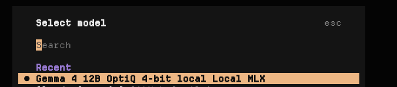
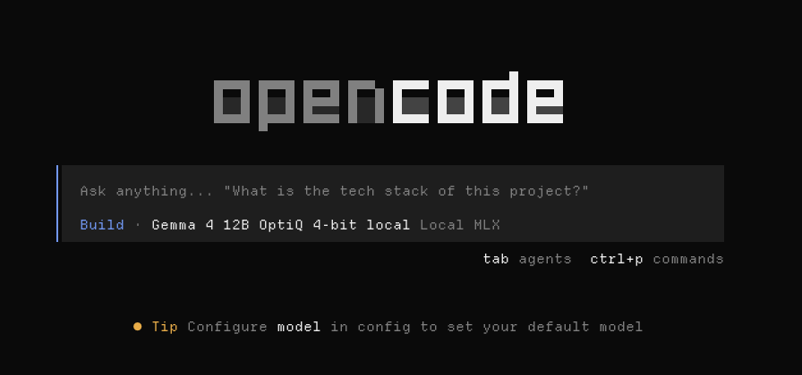
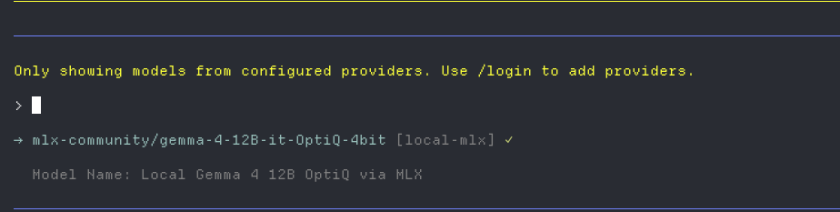

You can run a local coding agent on any reasonably powerful Apple Silicon Mac. You need to have [python](https://www.python.org/) installed.

## Selecting a model

We will use the [mlx-community](https://huggingface.co/mlx-community). We can use the hugging face API to list models. Let's say we want to use a [gemma](https://deepmind.google/models/gemma/) model. There are others like Qwen, Llama, etc.

```bash
curl -s "https://huggingface.co/api/models?author=mlx-community&sort=downloads&limit=1000" \
  | jq -r '.[].id' \
  | grep -i gemma
```

You will see a list of models like (there are a lot more than seen here, just showing a sample):

```text
mlx-community/gemma-3-4b-it-qat-4bit
mlx-community/gemma-4-12B-it-8bit
mlx-community/gemma-4-e2b-it-4bit
mlx-community/gemma-3-12b-it-qat-4bit
mlx-community/gemma-3-27b-it-qat-4bit
mlx-community/gemma-3-1b-it-qat-4bit
mlx-community/gemma-4-12B-it-4bit
mlx-community/gemma-4-e4b-it-4bit
mlx-community/gemma-4-26b-a4b-it-4bit
mlx-community/gemma-2-9b-it-4bit
mlx-community/gemma-4-12B-it-qat-4bit
mlx-community/gemma-4-31b-it-4bit
mlx-community/gemma-4-12B-it-OptiQ-4bit
mlx-community/gemma-4-12B-4bit
mlx-community/gemma-4-31b-it-8bit
mlx-community/gemma-4-e4b-it-OptiQ-4bit
mlx-community/gemma-4-12B-bf16
mlx-community/gemma-4-12B-it-bf16
mlx-community/gemma-4-26B-A4B-it-assistant-bf16
mlx-community/gemma-3-4b-it-8bit
mlx-community/diffusiongemma-26B-A4B-it-4bit
mlx-community/gemma-4-12B-8bit
mlx-community/gemma-3-1b-it-4bit
mlx-community/gemma-4-12B-it-nvfp4
mlx-community/gemma-4-31B-it-assistant-bf16
mlx-community/gemma-4-31B-it-OptiQ-4bit
mlx-community/gemma-4-12B-it-mxfp8
mlx-community/gemma-4-12B-it-assistant-bf16
```

The naming convention is `{model name}-{model size}-{if 'it', instruction tuned (good for agentic stuff)}-{weight precision / quantization}`.

There's a lot going on with those names but they contain the information you need to pick a model for your machine.

## A tool to help pick a model

I created a MacOS cli for helping to pick a local model based on your system: <https://github.com/ruarfff/help-pick-local-model>


## Serving a model locally

1. Install dependencies:
   ```bash
   pip install mlx mlx-lm mlx-vlm
   ```
   Or if you use [uv](https://docs.astral.sh/uv/):
   ```bash
   uv tool install mlx-lm && uv tool install mlx-vlm
   ```

2. Start the local server with the selected model:

   ```bash
   mlx_lm.server --model mlx-community/gemma-4-26B-A4B-it-OptiQ-4bit --port 7777
   ```

   In step one, we're installing some dependencies to help us run local models, specifically on Apple silicon. 
   
   Step 2 can take a while depending on the size of the model. 
   
   If using a unified model, one that supports more than text, you use `mlx_vlm` instead, e.g.

   ```bash
   mlx_vlm.server --model mlx-community/gemma-4-12B-it-OptiQ-4bit --port 7777
   ```

   I picked port `7777` just to avoid clashing with the other usual ports I use for development.

3. Point your coding agent tool to the local server.

Step 3 depends on what tools you use. I'll cover a couple of them but whatever one you're using probably has docs on how to do this if it's an option.


## Setting up a coding agent to use your local model

Most coding agents allow you to BYOM (bring your own model) but the experience varies. 

### Copilot

For [Github copilot CLI](https://github.com/features/copilot/cli) you can bring your own model but you need to start a dedicated session configured with environment variables. 

I use a shell function like this:

```bash
copilot-local-mlx() {
  export COPILOT_PROVIDER_TYPE=openai
  export COPILOT_PROVIDER_BASE_URL=http://127.0.0.1:7777/v1
  export COPILOT_PROVIDER_API_KEY=local-not-used
  export COPILOT_MODEL="${COPILOT_MODEL:-mlx-community/gemma-4-26B-A4B-it-OptiQ-4bit}"
  export COPILOT_PROVIDER_MAX_PROMPT_TOKENS="${COPILOT_PROVIDER_MAX_PROMPT_TOKENS:-32768}"
  export COPILOT_PROVIDER_MAX_OUTPUT_TOKENS="${COPILOT_PROVIDER_MAX_OUTPUT_TOKENS:-4096}"
  export COPILOT_OFFLINE=true

  copilot "$@"

}
```

If you add that to your `~./.bashrc`, `~/.zshrc` etc. you can run copilot with a local model by running `copilot-local-mlx`.

Obviously modify the settings to suit your setup.

### OpenCode

You can configure OpenCode in the file `~/.config/opencode/opencode.json`. If you have run the local model on port `7777` like I have, adding this to your `opencode.json` file will make the model available to OpenCode:

```json
{
  "$schema": "https://opencode.ai/config.json",
  "model": "local-mlx/mlx-community/gemma-4-12B-it-OptiQ-4bit",
  "provider": {
    "local-mlx": {
      "models": {
        "mlx-community/gemma-4-12B-it-OptiQ-4bit": {
          "limit": {
            "context": 16000,
            "output": 4096
          },
          "name": "Gemma 4 12B OptiQ 4-bit local"
        }
      },
      "name": "Local MLX",
      "npm": "@ai-sdk/openai-compatible",
      "options": {
        "baseURL": "http://127.0.0.1:7777/v1"
      }
    }
  }
}
```

If you use [nix](https://nixos.org/) like I do, you can add this into your [home manager](https://github.com/nix-community/home-manager) config:

```nix
xdg.configFile."opencode/opencode.json".text = builtins.toJSON {
  "$schema" = "https://opencode.ai/config.json";
  provider = {
    local-mlx = {
      npm = "@ai-sdk/openai-compatible";
      name = "Local MLX";
      options = {
        baseURL = "http://127.0.0.1:7777/v1";
      };
      models = {
        "mlx-community/gemma-4-12B-it-OptiQ-4bit" = {
          name = "Gemma 4 12B OptiQ 4-bit local";
          limit = {
            context = 16000;
            output = 4096;
          };
        };
      };
    };
  };
  model = "local-mlx/mlx-community/gemma-4-12B-it-OptiQ-4bit";
};
```

Restart OpenCode, run `/models` and select the local model.





### Pi

For Pi, you can update our models.json. 

Make sure the file exists and open an editor.

```bash
mkdir -p ~/.pi/agent
vim ~/.pi/agent/models.json
```

Configure the local model like this:

```json
{
  "providers": {
    "local-mlx": {
      "baseUrl": "http://127.0.0.1:7777/v1",
      "api": "openai-completions",
      "apiKey": "local-not-used",
      "compat": {
        "supportsDeveloperRole": false,
        "supportsReasoningEffort": false,
        "supportsUsageInStreaming": false,
        "maxTokensField": "max_tokens"
      },
      "models": [
        {
          "id": "mlx-community/gemma-4-12B-it-OptiQ-4bit",
          "name": "Local Gemma 4 12B OptiQ via MLX",
          "reasoning": false,
          "input": ["text"],
          "contextWindow": 16000,
          "maxTokens": 4096,
          "cost": {
            "input": 0,
            "output": 0,
            "cacheRead": 0,
            "cacheWrite": 0
          }
        }
      ]
    }
  }
}
```


