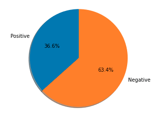
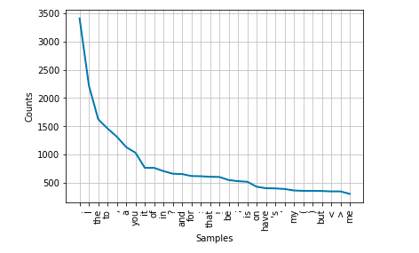

[Sentiment](https://dictionary.cambridge.org/dictionary/english/sentiment)

> a thought, opinion, or idea based on a feeling about a situation, or a way of thinking about something

[Sentiment analysis](https://en.wikipedia.org/wiki/Sentiment_analysis), in the context of this article, is the use of natural language processing to quantify the general opinion or mood of some text. We will keep it simple and only look at determining if some text is positive or negative. Positive being generally complimentary in nature. Negative being generally critical in nature. To add some level of (perhaps impractical) practicality we will look at analysing text from a [Slack](https://slack.com/) channel.

In this article we will:

- Download chat history from a public slack channel (which is optional as you can really use any text)
- Use some python tools to process and inspect the chat data
- Use a pre-trained model to classify sentences from the chat as positive or negative
- Train our own custom model with some training data
- Test our own model and use it on the slack data
- Prepare a docker image with our model so we can deploy and use it as a service

If you just want to look at some code, [this GitHub repository](https://github.com/ruarfff/slack-sentiment) has everything. The [jupyter notebook](https://jupyter.org) in it also includes a lot of the instructions from here. In this article we will look at all the steps in excruciating detail so we really understand how it all works.

## Setup

The easiest thing to do it the clone [this GitHub repository](https://github.com/ruarfff/slack-sentiment). It is using [pipenv](https://packaging.python.org/tutorials/managing-dependencies/#managing-dependencies) to manage dependencies so if you follow the [Readme](https://github.com/ruarfff/slack-sentiment/blob/main/README.md) and you have a recent version of [python](https://www.python.org) as well as [pipenv](https://pipenv-fork.readthedocs.io/en/latest/) installed, you should be good to go.

```bash
git clone git@github.com:ruarfff/slack-sentiment.git

cd slack-sentiment

pipenv sync --dev

pipenv run notebook
```

The example is mostly run in a [jupyter notebook](https://jupyter.org). Of course feel free to use your own setup instead and copy code from here as needed. If you don't want to use `pipenv` you can also install all the dependencies listed in the Pipfile using pip directly.

e.g.

```bash
pip install jupyter slack-sdk nltk numpy pandas matplotlib
```

## Get Data from a Slack Channel

I know I don't need to say this but obviously be careful and understand the sensitivity of your slack data. I ran this against a slack channel with friends. I used slack as I thought it was a nice example for taking data from an arbitrary source and processing it. It was also a fun example to use.

I won't go into too much detail here as the [slack documentation](https://api.slack.com) is good but here's a brief explanation of how to get the chat history for a channel.

You will need to get the ID for the channel and a token to make a request to the slack api.

**To get the slack channel ID:**

There is probably an easier way but the one I use is to right click the channel name in the channel menu and select "Copy link". The link will look something like `https://your-org.slack.com/archives/C12345`. The channel ID is the last piece. That's `C12345` in the example URL.

**To get a token:**

Setup a bot user following these instructions <https://api.slack.com/bot-users>.
The OAuth scope must allow `channels:history`. Add the bot user to the channel you wish to read messages from. The channel should be public. I have not tested any of this with private channels.

The next section assumes you have 2 environment variables:

`SLACK_SENTIMENT_BOT_TOKEN` - The bot token we setup previously.

`SLACK_SENTIMENT_CHANNEL_ID` - The channel ID we retrieved previously.

If you are not familiar with how to setup environment variables, feel free to just replace those values with hardcoded values but obviously be careful not to accidentally push your token up to Github or something like that :)
Incidentally, I do have a [post on managing secrets while developing](https://dev.to/ruarfff/managing-local-app-secrets-and-sharing-secrets-with-your-team-34m1) if you're interested.

The following python example gets all the slack messages for a channel and prints them:

```python
# Get a timestamp for 7 days ago in a weird way. I need to lean more python.
# This is only used if we want to limit how far back in time we go for fetching slack messages.
from datetime import timedelta, datetime, date
today = date.today()
week_ago = today - timedelta(days=7)
week_ago_timestamp = (datetime.combine(week_ago, datetime.min.time()) - datetime(1970, 1, 1)) / timedelta(seconds=1)

import os
# Import WebClient from Python SDK (github.com/slackapi/python-slack-sdk)
from slack_sdk import WebClient
from slack_sdk.errors import SlackApiError
import json
from time import sleep

token = os.environ.get("SLACK_SENTIMENT_BOT_TOKEN")
channel_id = os.environ.get("SLACK_SENTIMENT_CHANNEL_ID")
page_size = 100

client = WebClient(token=token)

conversation_history = []
has_more = True
cursor = None

try:
    while has_more:
        has_more = False
        result = client.conversations_history(
            channel=channel_id,
            limit=page_size,
            cursor=cursor
            # If you wanted to limit to the last 7 days uncomment the next line and put a , after cursor on the previous line
            # oldest = week_ago_timestamp
        )
        conversation_history.extend(result["messages"])
        has_more = result['has_more']
        if result['response_metadata'] is not None:
            print('Still fetching')
            cursor = result['response_metadata']['next_cursor']
            sleep(0.5) # Avoid being rate limited
    print('Done!')
except SlackApiError as e:
    print("Error getting conversations: {}".format(e))

print(conversation_history)
```

## Prepare the Data

In data engineering a huge amount of time is spent organising and cleaning data. Slack is just one example of a wide variety of extremely versatile data sources. In the following example we will gently dip our toes into that kind of work. Let's take our slack messages and clean them up a bit. Let's also break them up into sentences and words.

I will just drop our main data cleaning function in here and then go through it line by line.

```python
import nltk
from nltk.tokenize import word_tokenize, sent_tokenize
import itertools

def get_test_data():
    all_text = [message['text'] for message in conversation_history if 'text' in message]
    tokenized_text = [sent_tokenize(text) for text in all_text]
    sentences = list(itertools.chain(*tokenized_text))
    tokenized_words = [word_tokenize(sentence) for sentence in sentences]
    words = list(itertools.chain(*tokenized_words))
    return (sentences, words)

main_sentences, main_words = get_test_data()
```

**Line by line**

`all_text = [message['text'] for message in conversation_hissory if 'text' in message]`

The response from the Slack API stores the text from the slack conversation in a field called text. We don't want any of the other information like the user who posted it or the time it was posted. That line iterates over each response and extracts the text to a new list.

`tokenized_text = [sent_tokenize(text) for text in all_text]`

Iterate over all the text and use NLTK's sentence tokeniser to split the text up into sentences.

`sentences = list(itertools.chain(*tokenized_text))`

The previous line actually gave us a list of lists since `sent_tokenize` returns a list. This line flattens that to a single list.

`tokenized_words = [word_tokenize(sentence) for sentence in sentences]`

This line used NLTK's word tokeniser to split each slack message up into words.

`words = list(itertools.chain(*tokenized_words))`

`word_tokenize` returns a list so we ended up with a list of lists. This line flattens that to a single list.

`return (sentences, words)`

Here we are returning a [tuple](https://docs.python.org/3.3/library/stdtypes.html?highlight=tuple#tuple) containing the sentences and words. In this case, a tuple is just a handy way to return multiple things from a function without going to the bother of creating a new data type for it.

`main_sentences, main_words = get_test_data()`

We then assign the values from the returned tuple to 2 new variables. We will use these variables again throughout the rest of this example.

## Use a Pre-trained Model

We will be training our own model and we will look at how to deploy our own trained model soon. First it could be useful to look at an example of using a pre-trained model. We will use NLTK's [SentimentIntensityAnalyzer](https://www.nltk.org/api/nltk.sentiment.html).

You can import and setup the model like so:

```python
from nltk import download
import matplotlib.pyplot as plt
from nltk.sentiment import SentimentIntensityAnalyzer

# The SentimentIntensityAnalyzer model needs us to pull down the vader_lexicon
download('vader_lexicon')

sia = SentimentIntensityAnalyzer()
```

Then you can take one of the sentences from our slack "corpus" and pass it in:

```python
sia.polarity_scores(main_sentences[0])["compound"]
```

That will return a number. If the number is greater than 0 then we say the sentence has a positive sentiment.

Here's an example that checks each sentence and draws a pie chart showing the ratio of positive vs negative.

```python
num_pos = 0
num_neg = 0

def is_positive(sentence: str) -> bool:
    return sia.polarity_scores(sentence)["compound"] > 0

for s in main_sentences:
    if is_positive(s):
        num_pos +=1
    else:
        num_neg += 1

labels = 'Positive', 'Negative'
sizes = [num_pos, num_neg]

fig1, ax1 = plt.subplots()
ax1.pie(sizes, labels=labels, autopct='%1.1f%%',
        shadow=True, startangle=90)
ax1.axis('equal')

plt.show()
```

**Example output:**



This was just to show an example but it might also demonstrate the importance of the next step. The results we got from the data in its current state may not have been very accurate. Let's see what we can do to clean up the data and reduce the noise in there.

## Clean the Data

From this point on we won't be using the sentences from our dataset anymore. We will focus on the individual words instead. Let's create a frequency distribution graph of the words. This is also to demonstrate how many of them are more or less useless.

```python
from nltk.probability import FreqDist

fdist = FreqDist(main_words)

fdist.plot(30,cumulative=False)
plt.show()
```



If you run that, you probably see a lot of words like "I", "if", "me" etc. Also maybe some punctuations. These are not too useful for our analysis.

Let's look at a helper function to clean that up.

When we start training our own model we will be using a method where we store each word along with its frequency and train a model using those features (the words and frequency) along with labels (positive and negative).

We will need 2 functions. One to clean our data, removing noise such as meaningless words, punctuation etc. Then we need a function to convert a stream of words into a hashmap with words and number of occurences.

```python
# Assumes you previously had from nltk import download
download('stopwords')
download('names')

from nltk.corpus import stopwords, names
from string import punctuation

# A large set of names. We lowercase here as we will lowercase our own data first too
name_words = set([n.lower() for n in names.words()])
# A set of stopwords provided by NLTK (if, as etc.)
stop_words = set(stopwords.words("english"))

def clean_words(words):
    return [w for w in [w.lower() for w in words if w.isalpha()] if w not in stop_words and w not in name_words and w not in punctuation]
```

Let's split `clean_words` and look at each bit.

`w for w in [w.lower() for w in words if w.isalpha()]`

Go through all the words in the words array which is passed as an argument to our function. Check if a word is alphanumeric (no special characters we can't use). Then extract that out to a new list.

`if w not in stop_words and w not in name_words and w not in punctuation`

This filters our list. We filter out all those stop words. We filter out any names and punctuations. This gives us a cleaner set to work with.

You may be wondering what we are doing here? How can we analyse the data without context? We are going to use a pretty basic model. We will more or less be taking bags of words with labels and training a model with them. Then we will feed other bags of words to the model and have it make a guess at the sentiment. It doesn't know anything about actual sentences. It mostly goes off of word frequency.

To help us shape our data even more for later use we need one more function.

```python
def word_counts(words):
    counts = {}
    for word in words:
        counts[word] = counts.get(word, 0) + 1
    return counts
```

This takes our words and puts them into a HashMap where the key is the word and the value is the number of times that word has shown up in our data.

Now we can get the data ready.

```python
main_words = clean_words(main_words)
main_words_counts = word_counts(main_words)
```

You can create a new distribution graph and see if it looks better.

```python
fdist = FreqDist(main_words)
fdist.plot(30,cumulative=False)
plt.show()
```


## Training Our Own Model

Now we will train a model so we can call ourselves AI scientists. We will use something called a [Naive Bayes classifier](https://en.wikipedia.org/wiki/Naive_Bayes_classifier). NLTK provides one for us to use. Our main job here really is to provide a lot of labelled data to train the model and the library does the rest. Over time as we become more familiar with the data we might figure out clever ways of modifying it to improve our model. We will look briefly at that concept but will not go into it in any depth here.

In [the sample repo](https://github.com/ruarfff/slack-sentiment) for this there are some data files. These can also be downloaded from the [Sentiment Labelled Sentences Data Set](https://archive.ics.uci.edu/ml/datasets/Sentiment+Labelled+Sentences). We will also use some data provided by NLTK.

First we load the files from the repo using the [pandas library](https://pandas.pydata.org).

```python
import pandas as pd

amazon = pd.read_csv('sentiment_labelled_sentences/amazon_cells_labelled.txt', names=['review', 'sentiment'], sep='\t')
imdb = pd.read_csv('sentiment_labelled_sentences/imdb_labelled.txt', names=['review', 'sentiment'], sep='\t')
yelp = pd.read_csv('sentiment_labelled_sentences/yelp_labelled.txt', names=['review', 'sentiment'], sep='\t')
```

Those files must be located in a folder called `sentiment_labelled_sentences` in the same directory as the python script if using the code as is.

Now we download the movie review corpus provided by NLTK.

```python
# Assumes you previously had from nltk import download
download('movie_reviews')
```

The next step is to take all that data and split it into 2 lists. One list of negative reviews. The other of positive reviews.

```python
reviews = [*amazon['review'].values, *imdb['review'].values, *yelp['review'].values]
sentiment = [*amazon['sentiment'].values, *imdb['sentiment'].values, *yelp['sentiment'].values]

positive_reviews = []
negative_reviews = []

from nltk.corpus import movie_reviews

# Process the corpus data which is split into files with IDs of pos and neg
for f in movie_reviews.fileids('pos'):
    positive_reviews.append((word_counts(clean_words(movie_reviews.words(f))), 'pos'))
for f in movie_reviews.fileids('neg'):
    negative_reviews.append((word_counts(clean_words(movie_reviews.words(f))), 'neg'))

# Process the data we extracted from files into reviews and sentiment lists with matching indexes
for i, r in enumerate(reviews):
    review_words = word_tokenize(r)
    if sentiment[i] == 1:
        positive_reviews.append((word_counts(clean_words(review_words)), 'pos'))
    else:
        negative_reviews.append((word_counts(clean_words(review_words)), 'neg'))
```

Now that we have all that data prepared we can train a model.

```python
from nltk.classify import NaiveBayesClassifier

# We will use 80% of the data set for training and 20% for testing
split_pct = .80

pos_split = int(len(positive_reviews)*split_pct)
neg_split = int(len(positive_reviews)*split_pct)

train_set = positive_reviews[:pos_split] + negative_reviews[:neg_split]
test_set = positive_reviews[pos_split:] + negative_reviews[neg_split:]

model = NaiveBayesClassifier.train(train_set)
```

Here we split the data into training and testing sets:

```python
split_pct = .80

pos_split = int(len(positive_reviews)*split_pct)
neg_split = int(len(positive_reviews)*split_pct)

train_set = positive_reviews[:pos_split] + negative_reviews[:neg_split]
test_set = positive_reviews[pos_split:] + negative_reviews[neg_split:]
```

It's hard to know what the optimal split is but I have
[read some discussion indicating 80/20 might be a good start](https://stackoverflow.com/questions/13610074/is-there-a-rule-of-thumb-for-how-to-divide-a-dataset-into-training-and-validation).

Once we have our data read, the actual training of the model is simply calling one function provided by NLTK:

```python
model = NaiveBayesClassifier.train(train_set)
```

At this point we can start using the model to classify all that data we prepared from slack.

```python
model.classify(main_words_counts)
```

It is a good idea for us to use our test data and determine the accuracy of the model first though.

```python
from nltk.classify.util import accuracy

print(100 * accuracy(model, test_set))
```

When I checked the model it was coming in between 65% and 70% accurate. At this point there's some work to do to improve the model. I am not going to go into that now except to provide some basic pointers. Perhaps in a follow up article I will get into it. For now let's look at some things you can do to see where things need improving.

We can gather all the guesses that went wrong from the test data.

```python
errors = []
for (data, label) in test_set:
    guess = model.classify(data)
    if guess != label:
        errors.append((label, guess, data))

print(errors[0])
```

Looking at the places where guesses went wrong, maybe we can modify the data to improve the training. Maybe take variations on a word and ad that to the training set.

We can see which features our model believes are most informative.

```python
model.show_most_informative_features()
```

By getting a better understanding of how the model learns, we improve our ability to know how to train it. It's difficult but also interesting.

## Deploying a Model

Now we can save the model. You could push this model up somewhere and pull it in to some other useful location. For an example of how to deploy this model in a web service using docker please see the [Readme for this project](https://github.com/ruarfff/slack-sentiment/blob/main/README.md).

You can imagine some process whereby you train a model at some interval or on some event and push the model to a location from which it gets pulled down for use in another application or service.

Write the model to a file:

```python
import pickle

model_file = open('.models/sentiment_classifier.pickle','wb')
pickle.dump(model, model_file)
model_file.close()
```

For a full example of how to then use that model in a web service please make sure to look at the [Example Repository](https://github.com/ruarfff/slack-sentiment).

A quick example of how if might work follows:

```python
model_file = open('.models/sentiment_classifier.pickle', 'rb')
model = pickle.load(model_file)
model_file.close()

print(100 * accuracy(model, test_set))
model.show_most_informative_features()
model.classify(main_words_counts)
```

That's it. Hopefully this has been useful. Thank you for reading.

## References

I wrote this post as I was studying material from the following places:

[Training and Deploying an ML Model as a Microservice](https://www.manning.com/liveproject/training-and-deploying-an-ml-model-as-a-microservice)

[Text Analytics for Beginners using NLTK](https://www.datacamp.com/community/tutorials/text-analytics-beginners-nltk)

[Sentiment Analysis: First Steps With Python's NLTK Library](https://realpython.com/python-nltk-sentiment-analysis/)

[Training an ML Model for Sentiment Analysis in Python](https://medium.com/dev-genius/training-an-ml-model-for-sentiment-analysis-in-python-63b6b8c68792)
