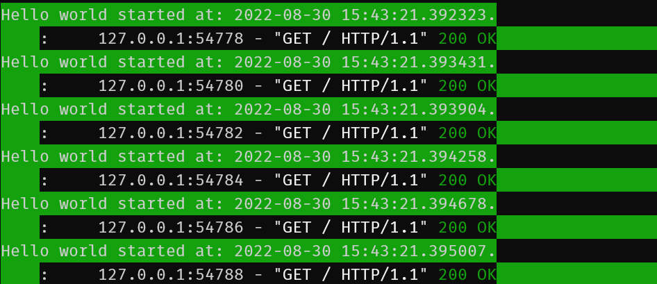
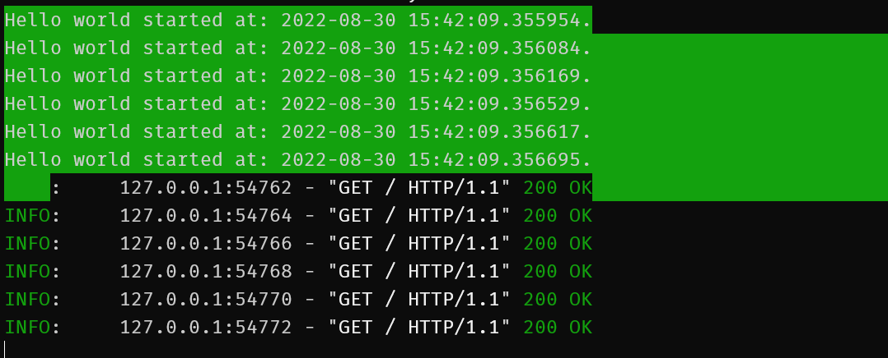
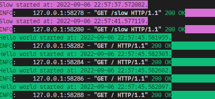
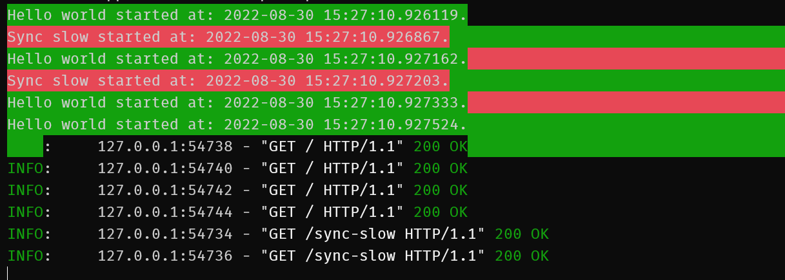
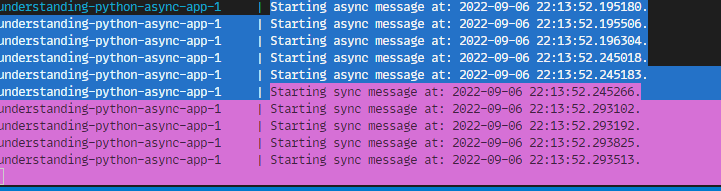

Writing asynchronous code in Python is quite powerful and can perform pretty well if you use something like [uvloop](https://uvloop.readthedocs.io/):

> uvloop makes asyncio fast. In fact, it is at least 2x faster than nodejs, gevent, as well as any other Python asynchronous framework. The performance of uvloop-based asyncio is close to that of Go programs.

Writing asynchronous code in Python is also pretty easy to mess up.

This post is an attempt to understand async Python a little better and make it easier to spot the common mistakes.

There's a repo if you'd like to have the code examples: <https://github.com/ruarfff/understanding-python-async>.

In this post, we will look at:

- async/concurrent vs parallel
- interesting things to know about async in Python
- async with FastAPI
- what to do if something you use doesn't support async

## Coding along

Grab the sample code:

- `git clone git@github.com:ruarfff/understanding-python-async.git && cd understanding-python-async`
- You should also have [curl](https://curl.se/) installed

You can use docker (recommended) or setup your Python environment.

### With docker

```
make build
```

### Without docker

If you're not using docker, make sure to have Python >= 3.8 installed.

You should be using a unix-like shell e.g. Linux, Mac, WSL.

- [pyenv](https://github.com/pyenv/pyenv)

```shell
pyenv install 3.10.6

pyenv global 3.10.6
```

- Setup a [virtual environment](https://docs.python.org/3/library/venv.html) and run all commands in this context

```shell
python -m venv ./.venv

source .venv/bin/activate
```

- Install requirements `pip install -r requirements.txt`

In the examples below, run the python scripts directly instead of using `make`.

## Async Vs Parallel

Parallel and asynchronous are not the same thing. If you have a good mental model for async vs parallel feel free to skip this section.

When I was in college I wrote a mobile game. I had to learn about [the game loop](https://gameprogrammingpatterns.com/game-loop.html).

Within the loop, I had code to:

- process inputs
- update the game state based on reactions to inputs and existing algorithms
- render the game

It was all perfectly synchronous so I couldn't have anything take too long or the game would become unplayable. I became obsessed with improving performance but I always hit limits. I was attempting to render at 30FPS (frames per second meaning the loop must carry out all processing at least 30 times per second). Every time I coded up a new game agent or increased the number of agents on the screen, the FPS would suffer and I'd go mad trying to figure out how to optimise performance again. Then one day, I discovered the joy and pain of async programming.

Mobile games ran on a single processor but using threading, you could simulate parallelism. It was, in fact, asynchronous but you didn't really have to think too hard about scheduling the threads. You hand that job over to the operating system. It did make things a lot more complicated and harder to understand though and that's the major tradeoff.

This might be fairly inaccurate but I like to think of asyncio (and its Cython-based friend uvloop) as a sort of game loop. It's not running in parallel but the loop will keep looping if you don't block it. If you do block it, you mess the whole thing up.

Where that mental model breaks down is when we think about CPU bound VS IO-bound.

Asynchronous code makes sense when there's a lot of waiting or the code is IO-Bound. It's somewhat more intuitive. Like when you are coding. Consider an example flow:

#### Task - get some code to production

- you write some code
- run and test the code
- commit and push the code
- watch the build pipeline
- get distracted and start chatting on slack/teams
- go for lunch
- remember you had a build pipeline running
- test the deployment
- done

There are steps you don't wait for e.g. watching the build pipeline. This is asynchronous and frees you up to do other things. It's not necessarily more efficient but it's better than sitting there waiting for the build pipeline to finish. You got other tasks done while also getting the code to production.

A build pipeline has steps that can be run in **parallel** e.g. testing and linting. This can be done in parallel if we give each step all its own resources and a dedicated machine. We could do all the steps **asynchronously** on one large machine but we can use many smaller, cheaper machines to do the work in parallel.

You can think of async as one resource doing many things at once and figuring out how not to wait for each thing to be finished. Parallel processing is multiple resources each working on separate tasks or parts of a task.

Throughout the rest of this post, we will be focusing on the asynchronous model. When writing python apps with a framework like FastAPI, we are generally doing IO-Bound work e.g. downstream requests, reading databases, files etc. The asynchronous model is most useful in this case.

We will focus primarily on the patterns for using [coroutines](https://docs.python.org/3/library/asyncio-task.html) and async/await.

## Example of async code using asyncio

```python
import asyncio
import datetime
import time

from colorama import init
from colorama import Fore, Back, Style


async def main():

    print(Back.GREEN + Fore.WHITE + "Starting synchronous work.", flush=True)

    start_time = datetime.datetime.now()

    synchronous_work()
    synchronous_work()

    end_time = datetime.datetime.now() - start_time

    print(
        Back.GREEN
        + Fore.WHITE
        + f"Ending synchronous work. Total time: {end_time.total_seconds(): .2} sec.",
        flush=True,
    )

    print(Back.MAGENTA + Fore.WHITE + "Starting awaiting async functions.", flush=True)

    start_time = datetime.datetime.now()

    await async_work(Back.LIGHTYELLOW_EX + Fore.WHITE)
    await async_work(Back.LIGHTRED_EX + Fore.WHITE)

    end_time = datetime.datetime.now() - start_time

    print(
        Back.MAGENTA
        + Fore.WHITE
        + f"Ending awaiting async functions. Total time: {end_time.total_seconds(): .2} sec.",
        flush=True,
    )

    print(Back.LIGHTBLUE_EX + Fore.WHITE + "Starting running async.", flush=True)

    start_time = datetime.datetime.now()

    tasks = [
        async_work(Back.LIGHTYELLOW_EX + Fore.WHITE),
        async_work(Back.LIGHTRED_EX + Fore.WHITE),
    ]

    await asyncio.gather(*tasks)

    end_time = datetime.datetime.now() - start_time

    print(
        Back.LIGHTBLUE_EX
        + Fore.WHITE
        + f"Ending running async. Total time: {end_time.total_seconds(): .2} sec.",
        flush=True,
    )

    print(Style.RESET_ALL)


def synchronous_work():
    print(Back.CYAN + Fore.WHITE + "Pretending to wait.")
    time.sleep(2)


async def async_work(colour: str = Fore.WHITE):
    print(colour + "Pretending to wait async.")
    await asyncio.sleep(2)


if __name__ == "__main__":
    init()
    asyncio.run(main())
```

Run it:

```
make async-example
```


This contrived example shows a simple case where asynchronous code got things done faster than blocking code.

Running 2 tasks that each take 2 seconds asynchronously allows them to be finished in 2 seconds.

If you await 2 async functions in sequence, it's sort of like it was done synchronously so if you really want multiple steps to run asynchronously you can use utilities such as the `asyncio.gather` function in that example.

## It's Async all the way down

You must use async all the way down. If you block at any point within an async function, you block everything.

We will explore this more in the FastAPI section but for now, it's important to be aware that this:

```pthon
async def synchronous_work_in_async_function():
    time.sleep(2)
```

Has very different effects to this:

```python
async def async_work():
    await asyncio.sleep(2)
```

## The GIL

The [python GIL](https://wiki.python.org/moin/GlobalInterpreterLock) (global interpreter lock) can lead to some issues when writing async code. For the most part, you'll probably never notice if you're writing IO-bound apps but for CPU bound, it may become an issue.

> The GIL prevents race conditions and ensures thread safety.

All threads in python share the same memory space. The GIL helps ensure thread safety for multiple threads interacting with the same variable.

An example of where this might be important. Python uses a ref count to determine if something should be garbage collected.

```python
import sys


def main():
    a_thing = "a thing"
    print(sys.getrefcount(a_thing))
    another_thing = a_thing
    print(sys.getrefcount(another_thing))
    del a_thing
    print(sys.getrefcount(another_thing))


if __name__ == "__main__":
    main()
```


If multiple threads are updating references, you might get an accidental garbage collection or a memory leak. The lock is there to ensure this doesn't happen and garbage collection is done safely.

The downside is this can affect performance.

> In hindsight, the GIL is not ideal, since it prevents multithreaded CPython programs from taking full advantage of multiprocessor systems in certain situations.

There are ways around this. Some libraries aren't affected by the GIL e.g. [Numpy.](https://numpy.org/).

When writing a web app with FastAPI, using async/await and a library like [uvicorn](https://www.uvicorn.org/), the GIL is less of an issue as we are primarily IO bound.

## Async FastAPI

FastAPI is [quite fast](https://fastapi.tiangolo.com/?h=perfor#performance), unless you make it not fast :)

How does that happen?

The [async docs for FastAPI](https://fastapi.tiangolo.com/async/) are really good. We won't repeat much from them here but instead look at some examples.

A "hello world" FastAPI app looks like this:

```python
from fastapi import FastAPI

app = FastAPI()


@app.get("/")
async def root():
    return {"message": "Hello World"}
```

When we start up our FastAPI service, it will handle requests asynchronously on the eventloop. One worker should be able to handle many requests in this scenario.

Let's see what that looks like. If you have the [examples repo](https://github.com/zoe/understanding-python-async) you can run ./test-endpoints.sh to see all these outputs or feel free to follow along step by step here.

Create a hello world sample like the following:

`touch src/fastapi_example.py`

```python
from fastapi import FastAPI
import time
import datetime
import asyncio

from colorama import init
from colorama import Fore, Back, Style

app = FastAPI()


@app.get("/")
async def root():
    start_time = datetime.datetime.now()
    print(
        Back.GREEN + Fore.WHITE + f"Hello world started at: {start_time} sec.",
        flush=True,
    )
    return {"message": "Hello World"}
```

We can hit the same endpoint multiple times simultaneously with curl.

Create a text file like this:

`touch test_urls.txt`

Add this content:

```
url = "http://127.0.0.1:8000/"
url = "http://127.0.0.1:8000/"
url = "http://127.0.0.1:8000/"
url = "http://127.0.0.1:8000/"
```

Start your FastAPI app:

`uvicorn src.fastapi_example:app --reload`

In another console, run the test script:

`./test-endpoints.sh`

You should see output similar to the following:

```
{"message":"Hello World"}{"message":"Hello World"}{"message":"Hello World"}{"message":"Hello World"}{"message":"So slow"}{"message":"So slow"}
```

In the application logs:


That was perhaps too fast to prove anything.

Update your endpoint with `await asyncio.sleep(4)`:

```python
@app.get("/")
async def root():
    start_time = datetime.datetime.now()
    print(
        Back.GREEN + Fore.WHITE + f"Hello world started at: {start_time} sec.",
        flush=True,
    )
    await asyncio.sleep(4)
    return {"message": "Hello World"}
```

Run the test again:



Despite each call not responding for 4 seconds, they all kicked off at the same time. FastAPI is handling requests asynchronously.

Now to demonstrate where things can go wrong, let's add another endpoint:

```python
@app.get("/slow")
async def slow():
    start_time = datetime.datetime.now()
    print(
        Back.GREEN + Fore.WHITE + f"Slow started at: {start_time} sec.",
        flush=True,
    )
    time.sleep(4)
    return {"message": "So slow"}
```

Here's we're using the blocking `time.sleep` instead of the non blocking `asyncio.sleep`.

Use the `curl_configs/test_urls_slow.txt` file:

```
url = "http://127.0.0.1:8000/slow"
url = "http://127.0.0.1:8000/slow"
url = "http://127.0.0.1:8000/"
url = "http://127.0.0.1:8000/"
url = "http://127.0.0.1:8000/"
url = "http://127.0.0.1:8000/"
```

The order is important. We want the slow ones to kick off first.

Update the curl command to allow 6 concurrent requests:

`curl --parallel --parallel-immediate --parallel-max 6 --config curl_configs/test_urls_slow.txt`



Oops! We just blocked all requests from being processed.

The main takeaway from this is, you just can't mix asynchronous and synchronous functionality in a FastAPI application this way.

Consider this next example:

```python
@app.get("/sync-slow")
def sync_slow():
    start_time = datetime.datetime.now()
    print(
        Back.LIGHTRED_EX + Fore.WHITE + f"Sync slow started at: {start_time} sec.",
        flush=True,
    )
    time.sleep(4)
    return {"message": "So slow"}
```

Notice, we are not specifying `async` on the function definition.

Use the `curl_configs/test_urls_sync_slow.txt` file:

```
url = "http://127.0.0.1:8000/sync-slow"
url = "http://127.0.0.1:8000/sync-slow"
url = "http://127.0.0.1:8000/"
url = "http://127.0.0.1:8000/"
url = "http://127.0.0.1:8000/"
url = "http://127.0.0.1:8000/"

`curl --parallel --parallel-immediate --parallel-max 6 --config curl_configs/test_urls_sync_slow.txt`
```



If you don't specify your endpoint as being async i.e. as [a coroutine](https://docs.python.org/3/library/asyncio-task.html), FastAPI will look after it for you instead as it will assume this route contains blocking calls whereas if you specify `async`, it's up to you to make sure it really is asynchronous.

Rules of thumb:

- if all your code uses coroutines i.e. all use async/await, use async when defining your route

- if any of your code is blocking e.g. using requests, some non aio ORM etc. do not use async when specifying the route

If you use [requests](https://docs.python-requests.org/en/latest/) or standard [SQLAlchemy](https://www.sqlalchemy.org/) anywhere in a route, you will block the execution.

Consider alternatives like:

- <https://docs.aiohttp.org/en/stable/>
- <https://docs.sqlalchemy.org/en/14/orm/extensions/asyncio.html>

## Pubsub

FastAPI is great at managing async within the context of the framework e.g. in a route. It cannot account for any code you write that may be running on some schedule or handling incoming events. Especially if you're using the same event loop.

To illustrate, let's add some pubsub:

`pip install --upgrade google-cloud-pubsub`

This example is pretty contrived and GCP specific but does demonstrate a common mistake.

If you don't want to use docker and would like to follow along please [install the gcloud cli](https://cloud.google.com/sdk/docs/install) and run the following to start a pubsub emulator:

`gcloud beta emulators pubsub start --project=example-project`

`$(gcloud beta emulators pubsub env-init)`

If you are using docker compose, the emulator is already setup for you in the sample code.

We are doing this so we can see what happens when our FastAPI application listens to messages out side of standard web requests.

Update our FastAPI app to handle messages:

Import the pubsub lib:

```python
from google.cloud import pubsub_v1
```

Setup a subscription:

```python
def create_standard_subscription() -> None:
    project_id = "example-project"
    topic_id = "testing"
    subscription_id = "testing-subscription"

    publisher = pubsub_v1.PublisherClient()

    subscriber = pubsub_v1.SubscriberClient()
    subscription_path = subscriber.subscription_path(project_id, subscription_id)
    topic_path = publisher.topic_path(project_id, topic_id)
    try:
        subscriber.create_subscription(
            request={"name": subscription_path, "topic": topic_path}
        )
    except:
        print("Subscription already exists")

    def callback(message: pubsub_v1.subscriber.message.Message) -> None:
        start_time = datetime.datetime.now()
        if message.data.decode("utf-8") == "non-blocking":
            print(
                Back.BLUE + Fore.WHITE + f"Starting async message at: {start_time}.",
                flush=True,
            )
            message.ack()
        elif message.data.decode("utf-8") == "blocking":
            print(
                Back.LIGHTMAGENTA_EX
                + Fore.WHITE
                + f"Starting sync message at: {start_time}.",
                flush=True,
            )
            time.sleep(5)
            message.ack()

    subscriber.subscribe(subscription_path, callback=callback)
    print(f"Listening for messages on {subscription_path}..\n")


@app.on_event("startup")
async def startup_event():
    create_standard_subscription()
```

Configure a pubsub client to send messages e.g.

`touch src/pubsub_client.py`

With the following content:

```python
from google.cloud import pubsub_v1 as pubsub
import itertools


def main():
    publisher = pubsub.PublisherClient()

    project_id = "example-project"
    topic_id = "testing"

    publisher = pubsub.PublisherClient()
    topic_path = publisher.topic_path(project_id, topic_id)

    try:
        topic = publisher.create_topic(request={"name": topic_path})
        print(f"Created topic: {topic.name}")
    except:
        print("Topic already exists")

    print("Run 5 non-blocking")
    for _ in itertools.repeat(None, 5):
        future = publisher.publish(topic_path, b"non-blocking")
        print(future.result())

    print("Run 5 blocking")
    for _ in itertools.repeat(None, 5):
        future = publisher.publish(topic_path, b"blocking")
        print(future.result())


if __name__ == "__main__":
    main()

```

We are going to send some messages to our app and see how it responds in different scenarios.

Start the app:

```
make up
```

Run the client in another session:

```
make pubsub
```

Or if you are not using docker:

```
python src/pubsub_client.py
```

You should see something like:

```
Created topic: projects/example-project/topics/testing
Run 5 non-blocking
1
2
3
4
5
Run 5 blocking
6
7
8
9
10

```

You should see output int he app console like this:


All the messages were processed asynchronously. The pubsub is using a callback and the eventloop used by FastAPI is not effected.

### Where async + pubsub can go wrong

You may be tempted to use something like [gcloud-aio-pubsub](https://pypi.org/project/gcloud-aio-pubsub/) with your fastapi app. You can use something like [nest-asyncio](https://pypi.org/project/nest-asyncio/) to hook into the fastapi eventloop. This will allow you to use the same eventloop for your pubsub client and let you use standard async await with event handling.

You should avoid this however. It is very easy to add a blocking call into an event handler. This will block the event loop and prevent any other events and web requests from being processed thus holding up your whole application.

It is advisable to keep it simple. Let fastapi deal with the complexity of asyncio and use a background thread for pubsub.

## Useful links

- <https://docs.aiohttp.org/en/stable/>

- <https://docs.sqlalchemy.org/en/14/orm/extensions/asyncio.html>

- <https://github.com/alex-sherman/unsync>

- <https://asherman.io/projects/unsync.html>

- <https://fastapi.tiangolo.com/async/>

- <https://github.com/mikeckennedy/async-await-jetbrains-webcast>

- <https://stackoverflow.com/questions/61316540/how-to-get-python-fastapi-async-await-functionality-to-work-properly>

- <https://asgi.readthedocs.io/en/latest/>

- <https://uvloop.readthedocs.io/>

- <https://www.uvicorn.org/>

- <https://stackoverflow.com/questions/41063331/how-to-use-asyncio-with-existing-blocking-library>

```

```
